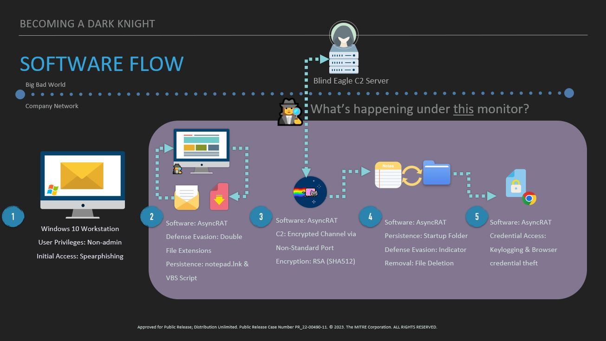

# Blind Eagle

[](https://opensource.org/licenses/Apache-2.0)

This repo contains the source code used to support the MITRE Engenuity's ATT&CK Evaluation team's 2023 BlackHat presentation 🎩 , [Becoming a Dark Knight: Adversary Emulation Demonstration for ATT&CK Evaluations](https://www.blackhat.com/us-23/briefings/schedule/#becoming-a-dark-knight-adversary-emulation-demonstration-for-attck-evaluations-33209). Using the Latin American threat actor known as Blind Eagle, the presentation provides an example of how our team develops adversary emulation plans and source code for MITRE Engenuity's ATT&CK Evaluation. This presentation is a point-in-time reference for our process which is constantly evolving.

Based on open-source intelligence, the ATT&CK Evaluation team created the below scenario leveraging techniques seen from Blind Eagle in the wild. We have adapted the scenario based on tools and resources available at the time.

## Adversary Overview 🙈 🦅

Blind Eagle (APT-C-36, Águila Ciega, ATT&CK Group [G0099](https://attack.mitre.org/groups/G0099/)) is a Spanish-speaking threat actor that has been active since at least 2018.<sup>[1]</sup>
The group is believed to be based in South America, given their use of regional Spanish dialects and intimate knowledge of government agencies and other local institutions in the region. Targets are focused on Colombia-based institutions, including entities in the financial, manufacturing, and petroleum sectors.<sup>[2]</sup> However, this threat actor has also executed operations against victims throughout South America, Europe, the US, and Australia.<sup>[3] [4]</sup> While Blind Eagle tends to be largely opportunistic in their motives, they have conducted espionage operations as well.<sup>[5]</sup>

Blind Eagle generally relies on commodity RATs, including Imminent Monitor, BitRAT, QuasarRAT, AsyncRAT, LimeRAT, and RemcosRAT.<sup>[6] [7] [8]</sup> This threat actor's campaigns often leverage spearphishing for initial access and the deployment of encrypted payloads.<sup>[2]</sup>
Additional common TTPs used by this threat actor include: use of malicious macros, process injection, and other LOTL techniques.<sup>[5] [9]</sup> The group also employs relatively strict targeting, and has been known to use link-shortening services that geoloate victims.<sup>[3]</sup>

[1]:https://attack.mitre.org/groups/G0099/
[2]:https://web.archive.org/web/20190625182633/https://ti.360.net/blog/articles/apt-c-36-continuous-attacks-targeting-colombian-government-institutions-and-corporations-en/
[3]:https://www.trendmicro.com/en_us/research/21/i/apt-c-36-updates-its-long-term-spam-campaign-against-south-ameri.html
[4]:https://webcache.googleusercontent.com/search?q=cache:DTTI-wdD7KcJ:blog.la.trendmicro.com/proyecto-rat-una-campana-de-spam-dirigida-a-entidades-colombianas-a-traves-del-servicio-de-correo-electronico-yopmail/&cd=10&hl=en&ct=clnk&gl=us
[5]:https://blogs.blackberry.com/en/2023/02/blind-eagle-apt-c-36-targets-colombia
[6]:https://www.ecucert.gob.ec/wp-content/uploads/2022/03/alerta-APTs-2022-03-23.pdf
[7]:https://lab52.io/blog/apt-c-36-recent-activity-analysis/
[8]:https://research.checkpoint.com/2023/blindeagle-targeting-ecuador-with-sharpened-tools/
[9]:https://blog.scilabs.mx/malware-campaign-attributed-to-apt-c-36-context-and-iocs-update-june-2022/

## Emulation Overview



## Quick Links

### For Engineers 👩‍💻

### Resources

The [Resources Folder](./Resources/) contains the emulated software source code.

We provide a [script](./Resources/Util/) to manage the various methods of obfuscating and encoding payloads. This script uses flags to identify the method of obuscation or encoding for each component of software. Each software contains a ReadMe.md with the specified flag need when executing this script. From the [Resources Folder](./Resources/), execute the below command with the correct flag `-flag` identified in the software's README.md.

```
python3 utilities/file-ops.py -flag
```

### Emulation Key Software 👾

- [Asyncrat](./Resources/AsyncRAT-C%23/)

- [VBS Loader](./Resources/Loaders/vb_loader/)

- [Fiber Loader](./Resources/Loaders/fiber/)

- [Fsociety Injector](./Resources/Loaders/Efsociety/)

### Scenario Walkthrough 🧭

- [Emulation Plan](./Emulation_Plan/README.md)

## For Analysts 🔎

- [Operation Flow](./Operations_Flow/Operations_Flow.md) - High-level summary of the scenario & infrastructure with diagrams.
- [Intelligence Summary](./Intelligence_Summary/intelligence_summary.md) - General overview of the Adversary with links to reporting used throughout the scenario.

## Acknowledgements 🤩

We would like to formally thank the people that contributed to the content, review, and format of this document. This includes the MITRE Engenuity teams, ATT&CK Evaluation teams, the organizations and people that provided public intelligence and resources. Thank you! 🙌 🥰

## Connect with us 🗨️

We 💖 feedback! Let us know how using ATT&CK Evaluation results has helped you and what we can do better.

Email: <ctid@mitre-engenuity.org><br>
LinkedIn: <https://www.linkedin.com/company/mitre-engenuity/><br>
Twitter: <https://twitter.com/MITREengenuity><br>

## Liability / Responsible Usage

This content is only to be used with appropriate prior, explicit authorization for the purposes of assessing security posture and/or research.

## Notice

© 2023 MITRE Engenuity, LLC.  Approved for Public Release. Document number CT0076

Licensed under the Apache License, Version 2.0 (the "License"); you may not use this file except in compliance with the License. You may obtain a copy of the License at

[http://www.apache.org/licenses/LICENSE-2.0](http://www.apache.org/licenses/LICENSE-2.0)

Unless required by applicable law or agreed to in writing, software distributed under the License is distributed on an "AS IS" BASIS, WITHOUT WARRANTIES OR CONDITIONS OF ANY KIND, either express or implied. See the License for the specific language governing permissions and limitations under the License.

This project makes use of [ATT&CK®](https://attack.mitre.org/)

[ATT&CK Terms of Use](https://attack.mitre.org/resources/terms-of-use/)
