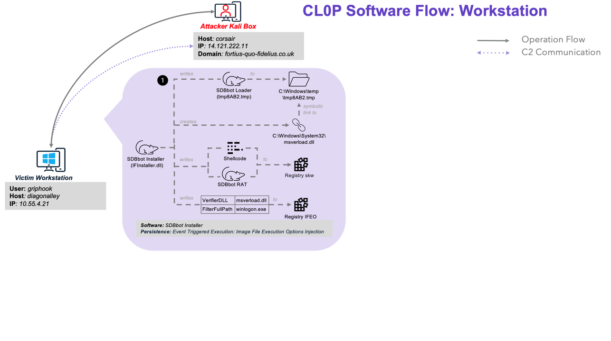
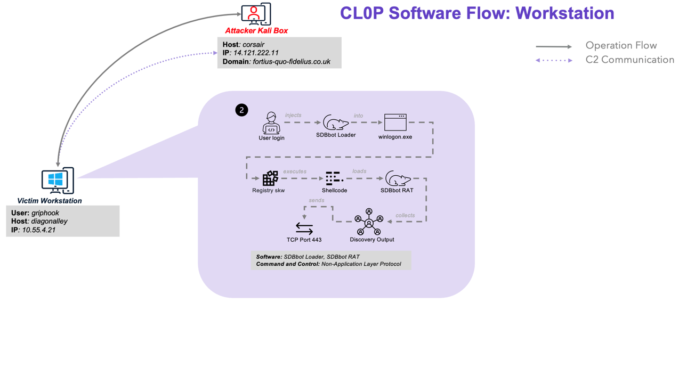
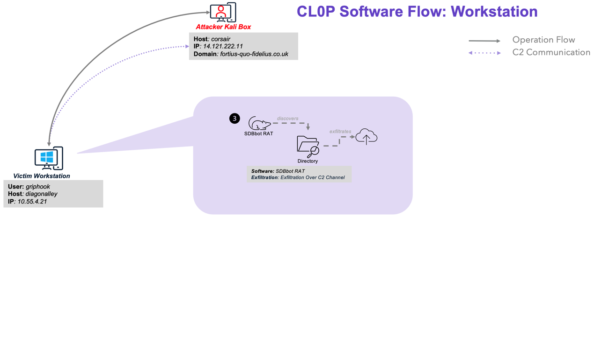
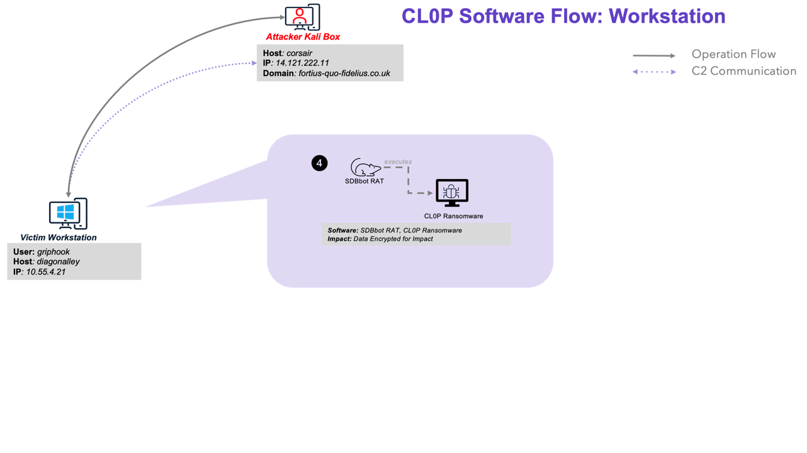

# Scenario Overview

This scenario involved attackers dropping Cl0P onto a victim admin user’s workstation and the subsequent theft and encryption of files. Included below is an overview of the attack sequence and major activities executed by the threat actor. For more detailed information about red team activities, please refer to the [Cl0P Emulation Plan](../Emulation_Plan/ER6_CL0P_Scenario.md).

The following activity is white carded and takes place outside the bounds of the scenario's official start: The attack began with a victim user receiving a malicious HTML attachment via phishing. Once opened, the HTML page stealthily redirected the user to a compromised website. This prompted the downloading of a document containing malicious macros and the deployment of the Get2loader onto the system. Get2loader is executed and collected essential system information including: the computer and usernames, OS version, and a list of running processes. This data was sent via HTTP post requests to a predetermined command and control (C2) server.

## Overview

1. The scenario starts with the attackers working to maintain persistence by downloading and executing **SDBbot**, a custom remote access Trojan (RAT) backdoor that eventually delivered the final Cl0P ransomware payload. The **SDBbot** installer, a DLL file located in the user's AppData\Roaming directory, stored the RAT component in the system registry. Given that the affected user had admin privileges on a Windows OS newer than version 7, the **SDBbot installer** established persistence through image file execution options injection.

    

2. As soon as the victim launched a browser, the **SDBbot loader** read the binary blob from the registry and executed it. This triggered the shellcode to load another DLL, setupapi.dll, which decompressed and executed the **SDBbot RAT** payload directly in memory. Establishing communication over TCP port 443, the RAT sent detailed discovery output, including: domain name, computer name, country code, OS version, user rights, and proxy settings.

    

3. The attackers then used **SDBbot** to deploy and execute the **Cl0P** ransomware on the victim's machine. Once unpacked and decompressed, **Cl0P** checked the system's keyboard layout and font settings, avoiding Russian language configurations to evade detection. **Cl0P** then performs a series of actions, including disabling security defenses, stopping various processes, and clearing Windows event logs. Next, the ransomware ran discovery on the target system. Upon locating a nearby Active Directory server, it hijacked the victim's RDP session to infiltrate the server.

    

4. **Cl0P** identified and encrypted files of interest using AES encryption, appending the [.]C_I0p extension to each. A ransom note, titled "Readme!_CI0P!.txt," was left behind. To further cripple recovery efforts, the ransomware deleted volume shadow copies, resized shadow copy storage, cleared Windows Event logs, and used bcedit to disable recovery options. Critical processes were terminated using TerminateProcess and netstop, leaving the victim's system in disarray.

    