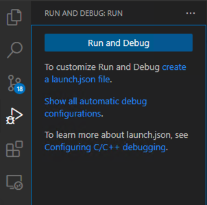
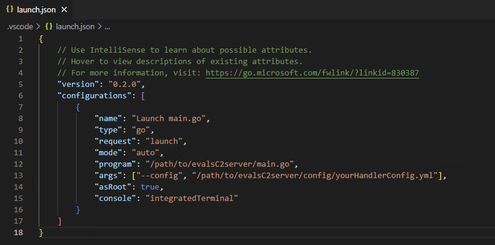

# Golang Debugging Guide

This guide is a quick overview on how to install and get started with the Golang debugger on VS Code.

## Step 1

You will first need to install the Go extension if you have not already. Click on the Extensions icon on the left pane of your window and search 'Go', the needed extension should be the first result. Once you have the Go extension installed, look to the bottom right of your screen on the status bar. If you see `⚠️ Analysis Tools Missing`, click on the warning to download the necessary dependencies. If you do not have the warning displayed, you are set to move on to Step 2.

## Step 2

You will need to create a `launch.json` config file. Click on the Debug icon on the left pane of VS Code. You should see the following:

Click on the `create a launch.json file` link to generate the file. If your Debug panel does not give you this option, you can just create the file manually. Create a new directory entitled `.vscode` and new file `launch.json` within it.

## Step 3

Configure your `launch.json` file to reflect the following:

Make sure to update the `"program"` and `"args"` fields to correctly reflect your filepaths to `main.go` and your handler config file.

## Step 4

Set your breakpoints and then click the green play icon at the top of the Debug panel to start the debugger.

Congratulations! You are now ready to start debugging your Go programs!
