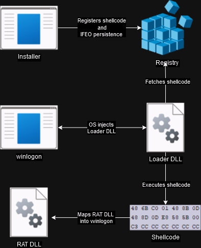
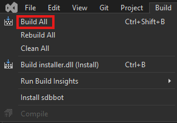
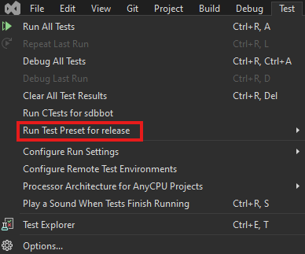
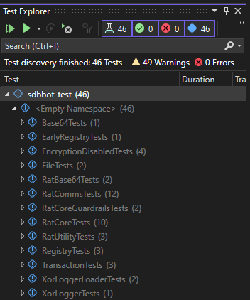

# SDBBot



SDBBot is a multi-stage payload with four primary components:

1. [Installer](src/installer)
2. [Loader](src/loader)
3. [Shellcode](src/shellcode)
4. [RAT](src/rat)

The installer uses the registry to stash the shellcode and lay persistence via
IFEO. Once IFEO triggers the persistence, the loader DLL is executed. It then
retrieves the stashed shellcode and executes it. The shellcode maps the RAT
into memory.

## Installer

The SDBBot installer is responsible for laying persistence on a victim host.
It takes the following steps to establish the infection chain:

1. Drops a [custom Application Verifier DLL](src/loader) to the configured location.
2. Drops a symlink in `C:\Windows\System32` which points to the verifier DLL.
3. Registers the symlink as a verifier DLL through [Image File Execution Options](https://learn.microsoft.com/en-us/previous-versions/windows/desktop/xperf/image-file-execution-options)
for the target host process (`winlogon` by default).
4. Registers the PE loading shellcode, later used by the custom verifier DLL,
to an HKLU key.

With this persistence in place, the host process will be forced to load the
custom verifier DLL any time a new instance is launched. In the default case
of `winlogon`, this will only happen at boot.

## Loader

The loader DLL is a custom Application Verifier DLL responsible for retrieving
the PE loading shellcode from the registry and executing it. It takes the
following steps to establish the infection chain:

1. Once a process configured to use the loader DLL as an IFEO `VerifierDLL` is
instantiated, the OS will force the loader DLL to be loaded into it.
2. Uses the Application Verifier mechanisms to place an IAT hook on
`NtSetProcessInformation`. Later, this IAT hook will call an export from the
RAT DLL.
3. Verifier DLLs have a special `DllMain` reason code that is called early in
loading process. At this time, the loader DLL retrieves the PE loading
shellcode from the registry and executes it. At this point the RAT DLL is
mapped into memory but not yet running.
4. Once the shellcode runs successfully the loader DLL will wipe and free it.
This is the last step that takes place at early load.
5. Once the process starts normal execution (fully loaded) and
`NtSetProcessInformation` is called, the hook creates a new thread passing the
RAT execution.

## Shellcode

The loader shellcode is a PE loader implemented in position-independent code.
Essentially it is a custom version of sRDI tailored for the early load event
of Application Verifier DLLs. It takes the following steps to establish the
infection chain:

1. Self extracts the embedded RAT DLL.
2. Loads the RAT on top of the signed decoy DLL specified
(`setupapi.dll` by default).
3. Updates the Process Environment Block to have the correct entrypoint for
the RAT.
4. Returns some information to the loader DLL.

In contrast to sRDI, the PE loader shellcode does _not_ call the RAT's
`DllMain` function. Rather, since the shellcode is executed prior to the
OS initializing dependencies we just update the PEB and let the OS call
`DllMain` on our behalf. The loader DLL is then responsible for executing the
RAT's primary export.

## RAT

The RAT is the final stage of the SDBBot infection. It is responsible for
maintaining a channel with the C2 server and executing post-exploitation
commands. On startup, the RAT will attempt to create a named mutex to ensure
that only one instance of the RAT is running. If the mutex creation fails,
the RAT will exit.

- The RAT will perform initial discovery actions by capturing the following information and returning it to the C2:
  - Domain name
  - Computer name
  - Username
  - Country code
  - Windows version
  - If the user is an administrator or not
- The RAT is capable of downloading, uploading and deleting files and running custom processes on the victim computer

### Packet Structure

#### Tasking Packet

```json
{
"header":"0xC0DE0000",   // string
"command":(Command Value),    // int
"Other/requirements":"(file paths, target executables, etc.)"    // string
}
```

#### Task Create/Download file FROM C2

```json
{
"header":"0xC0DE0000",   // string
"command":15, // int
"filePath":"path/to/file/destination", // string
"fileContents":"Base64 encoded file content",  // string
}
```

#### Task Upload File TO C2

```json
{
"header":"0xC0DE0000",   // string
"command":24, // int
"filePath":"path/to/file/destination", // string
}
```

#### Task Delete File From Disk

```json
{
"header":"0xC0DE0000",   // string
"command":26, // int
"filePath":"path/to/file/destination", // string
}
```

#### Task Execute a Command

```json
{
"header":"0xC0DE0000",   // string
"command":2,  // int
"execute":"command to execute",   // string

}
```

#### Implant Response Packet

```json
{
"header":"0xC0DE0000",   // string
"command":"(Command Value)",    // string
"response":"(command output, file data, etc.)" // string
}
```

#### Implant Recon Packet

```json
{
"header":"0xC0DE0000",   // string
"command":"42"  //string
"ver":"2.0",  // string
"domain":"Domain name",  // string
"pc":"Computer name",    // string
"geo":"two letter country code",  // string
"os":"OS Build info", // string
"rights":"admin"/"user", // string
"proxyenabled":0,  // boolean
}
```

#### Packet Encryption

Encryption can be toggled on/off using the CmakePresets setting `RAT_ENCRYPT_COMMS`. The key used
for encryption is located at `Settings::key` in `settings.cpp`.
Encryption consists of:
- XORing the payload data (string)
- Then Base64 encoding that string

### Logging/Troubleshooting

When compiled in debug mode, the SDBBot RAT will create a log file in the image execution directory. The log file name is `mswinsdr64.log`.

#### Decoding the log file

The log file is base64 encoded and XOR encrypted. The log file decryptor can be found here: [log_decryptor](../log_decryptor/)

The XOR key used to decrypt the log file is `0x0F, 0x00, 0x00, 0x0D`:

```bash
python3 aes_base64_log_decryptor.py -i mswinsdr64.log -o dec_mswinsdr64.log -k 0F00000D --xor
```

View the contents of the decrypted log file:

```bash
cat dec_mswinsdr64.log
```

### Integration Test

TCP integration test located at [integration_test.ps1](tests/scripts/integration_test.ps1). You can run the test with the following command:

```PowerShell
.\integration_test.ps1
```

The test will start a TCP listener on port 443 and wait for a connection, then send back a response.

## Build 🏗️

SDBBot can be built in Debug or Release mode using the included
`CMakePreset.json` configurations.

### Dependencies

- `CMake` version `3.26`
- `CMakePresets.json` version `6` support (Visual Studio 17.7)

### Quickstart

#### Command Line

Build both Debug and Release configurations of SDBBot.

```PowerShell
cd cl0p/Resources/sdbbot
cmake.exe --workflow --preset cicd-debug
cmake.exe --workflow --preset cicd-release
```

For simplicity, all of the generated artifacts can be bundled into the
top-level `install/` directory using the CMake installation facility.

```PowerShell
cmake.exe --install ./build --config release
cmake.exe --install ./build --config debug
```

`./install/Release/installer.dll` is the production payload for
SDBBot. `installer-runner.exe` will load the installer DLL and call its
export for simplified testing.

The remaining artifacts are simply for debugging and archival purposes. For
more information see the [Install section](#artifacts)

### Configuration

SDBBot has several CMake options available to change the compile-time
configuration of SDBBot. These options reside in the
[SDBBot CMake configuration file](cmake/SDBBot.cmake), and can be toggled in
`CMakePresets.json` using `cacheVariables`.

| **Variable**                  | **Default**                                 | **Description**                                        |
|-------------------------------|---------------------------------------------|--------------------------------------------------------|
| INSTALLER_STUB_LOADER         | OFF                                         | Installer uses the stub version of the loader          |
| INSTALLER_STUB_SHELLCODE      | OFF                                         | Installer uses the stub version of the shellcode       |
| LOADER_STUB_INSTALLER         | OFF                                         | Loader uses the stub version of the installer          |
| LOADER_STUB_SHELLCODE         | OFF                                         | Loader uses the stub version of the shellcode          |
| SHELLCODE_STUB_RAT            | OFF                                         | Shellcode uses the stub version of the RAT             |
| RAT_HOST_DLL                  | setupapi                                    | DLL which the RAT will be overwritten on               |
| RAT_HOST_DLL_EXPORT           | SetupAddToSourceListW                       | Dummy export used to trigger host DLL linkage          |
| LOADER_SHELLCODE_KEY          | skw                                         | Registry key where PE loader shellcode will be stashed |
| LOADER_SHELLCODE_VALUE        | d                                           | Registry key value containing PE loader shellcode      |
| LOADER_SHELLCODE_DATA         | 0xcc,0xc3                                   | Stub shellcode for testing (breakpoint then return)    |
| IFEO_TARGET_PROCESS           | winlogon.exe                                | IFEO injected persistence process                      |
| IFEO_FILTER_FULL_PATH         | C:\\\\Windows\\\\System32\\\\winlogon.exe   | Full path to the persistence process                   |
| LOADER_DROP_PATH              | C:\\\\Windows\\\\temp\\\\tmp8AB2.tmp        | Drop path for the loader DLL                           |
| LOADER_SYMLINK                | msverload.dll                               | Name of the symlink that will redirect to loader DLL   |
| RAT_ENCRYPT_COMMS             | ON                                          | Encrypt RAT communication                              |
| RAT_C2_IP_ADDRESS             | 223.246.0.70                                | C2 IP address for RAT                                  |
| RAT_C2_PORT                   | 8080                                        | C2 TCP port for RAT                                    |
| RAT_PACKET_HEADER             | 0x0000000F                                  | C2 RAT packet headers                                  |

### Build Presets

#### Command Line

```PowerShell
cmake.exe --build --preset release # Or debug
```

#### Visual Studio

After selecting the release configuration preset:
`Build -> Build All`



## Install 📦

Installing SDBBot simply copies all of the artifacts from both Release
and Debug builds into the top-level `install/` directory. This is simply for
ease of use and distribution.

The final product should be a top-level directory named `install/` with the
following layout:

```PowerShell

sdbbot/
├─ install/
   ├─ Debug/
   │  ├─ alternative-loader.dll
   │  ├─ alternative-loader.lib
   │  ├─ alternative-loader.pdb
   │  ├─ installer-runner.exe
   │  ├─ installer-runner.pdb
   │  ├─ installer.dll
   │  ├─ installer.lib
   │  ├─ installer.pdb
   │  ├─ loader-runner.exe
   │  ├─ loader-runner.pdb
   │  ├─ loader.dll
   │  ├─ loader.lib
   │  ├─ loader.pdb
   │  ├─ rat-runner.exe
   │  ├─ rat-runner.pdb
   │  ├─ rat.dll
   │  ├─ rat.lib
   │  ├─ rat.pdb
   │  ├─ shellcode-blob.bin
   │  ├─ shellcode-runner.exe
   │  ├─ shellcode-runner.pdb
   │  ├─ shellcode.exe
   │  ├─ shellcode.pdb
   ├─ Release/
      ├─ installer-runner.exe
      ├─ installer.dll
      ├─ installer.lib
      ├─ loader-runner.exe
      ├─ msverload.dll
      ├─ msverload.lib
      ├─ msverload_alt.dll
      ├─ msverload_alt.lib
      ├─ rat-runner.exe
      ├─ setupapi.dll
      ├─ setupapi.lib
      ├─ shellcode-blob.bin
      ├─ shellcode-runner.exe
      ├─ shellcode.exe
```

> [!Important]
> There are some differences in the functionality of SDBBot between Release
> and Debug configurations. Please read the
> [Troubleshoot section](#troubleshoot-) for more information.

### Artifacts

- `installer.dll` is the SDBBot persistence installer
- `installer-runner.exe` is a convenience runner for the installer DLL
- `msverload.dll` is the custom Application Verifier DLL
- `loader-runner.exe` is a convenience runner for the custom Application Verifier DLL
- `setupapi.dll` is the RAT DLL
- `rat-runner.exe` is a convenience runner for the RAT DLL
- `shellcode-runner.exe` is a convenience runner for the PE loader shellcode
- `shellcode-blob.bin` is the PE loader shellcode, with the RAT DLL embedded, and a plaintext prefix
- `msverload_alt.dll` is a standalone version of the custom Application Verifier DLL that can run via `rundll32`

> [!Note]
> The release version of several components have different names than their
> debug version counterparts. This is to reduce any compilation artifacts
> which leak the development naming scheme.

#### Command Line

```PowerShell
cmake.exe --install ./build
```

#### Visual Studio

`Build -> Install SDBBot`


## Test 🧪

The included [CMake workflows](#command-line) will build and test SDBBot with a
single command. This section details how to run tests independently from the
build process.

### Tools

SDBBot includes runners to test each layer of the final payload independently:

- `installer-runner.exe` executes the installer DLL's export directly
- `loader-runner.exe` executes the custom Application Verifier DLL's export directly
- `rat-runner.exe` executes the RAT DLL's export directly
- `rat-shellcode-runner.exe` executes the RAT DLL as an sRDI payload to check for shellcode loader incompatibilities
- `shellcode-runner.exe` executes the shellcode PE loader with the embedded RAT

#### Command Line

```PowerShell
ctest.exe --preset all
```

#### Visual Studio

`Test -> Run test preset for SDBBot -> all`



`Test Explorer` can also be used however test discovery can be unreliable
without a fresh build.



## Troubleshoot 🤔

### Logs
>
> [!Note]
> Release versions of components will not drop a log file. For troubleshooting
> scenarios, consider using the debug version of a component to make use of
> symbols and logs.

Some components will drop encrypted logs in their current working directory.
These logs can be used to trace execution at critical junctures and narrow
down issues.

### Test Tools

The included [test runners and payloads](#tools) can be used to narrow down
issues. For example if there is an issue with the RAT, consider first
validating the RAT's execution as a normal DLL using the `rat-runner`. If the
issue is reproducible the root cause can be assumed to be in the RAT itself.
Otherwise, the issue is likely due to an issue with the loader. The
`rat-shellcode-runner` and `shellcode-runner` can then be used to further
examine loader incompatibilities.

Runner targets are located in the [tests directory](tests/runners).

### Stubs

This project includes a number of stubs that were used early in development
for dependency isolation. These stubs may come in handy for further
development or troubleshooting. Consult the [SDBBot CMake configuration](cmake/SDBBot.cmake)
file for more information.

Stub targets are located in the [tests directory](tests/stubs).

## CTI 📄

| Reports |
| ---------------------------- |
| [APT10: Tracking down the stealth activity of the A41APT campaign](https://sensepost.com/blog/2020/masquerading-windows-processes-like-a-doubleagent./) |
| [TA505 Distributes New SDBbot Remote Access Trojan with Get2 Downloader](https://www.proofpoint.com/us/threat-insight/post/ta505-distributes-new-sdbbot-remote-access-trojan-get2-downloader) |
| [TA505 Continues to Infect Networks With SDBbot RAT](https://securityintelligence.com/posts/ta505-continues-to-infect-networks-with-sdbbot-rat/) |
| [Threat Encyclopedia](https://www.trendmicro.com/vinfo/us/threat-encyclopedia/malware/SDBOT) |
| [Ransomware Spotlight: Clop](https://www.trendmicro.com/vinfo/us/security/news/ransomware-spotlight/ransomware-spotlight-clop) |
| [Cyberreason vs. Cl0p Ransomware](https://www.cybereason.com/blog/research/cybereason-vs.-clop-ransomware) |

## References 📝

| Description                  | URL |
| ---------------------------- | --------------------------------------------------------------- |
| Application Verifier Custom Providers | [namazso/SecureUxTheme](https://github.com/namazso/SecureUxTheme/blob/master/AVRF.md) |
| C++ to Shellcode | [robleh/assemblyline](https://github.com/robleh/assemblyline) |
| Module Overloading | [hasherezade/module_overloading](https://github.com/hasherezade/module_overloading) |
| Module Overloading | [TheWover/donut](https://github.com/TheWover/donut) |
| PE Loader | [monoxgas/sRDI](https://github.com/monoxgas/srdi) |
| Application Verifier | [Microsoft](https://learn.microsoft.com/en-us/windows-hardware/drivers/devtest/application-verifier) |
| Application Verifier | [Sensepost](https://sensepost.com/blog/2020/masquerading-windows-processes-like-a-doubleagent./) |

### Artifacts removed
- SDBBot log `mswinsdr64.log`
- CL0P log `Favbug.txt`
