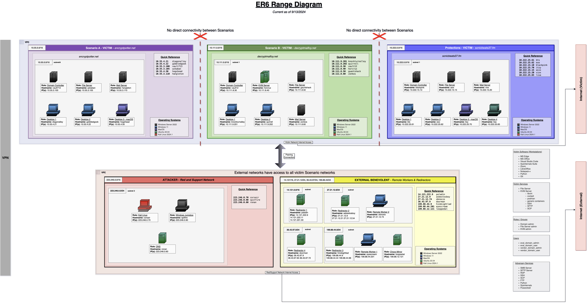

# Infrastructure for [ATT&CK Evaluations](https://attackevals.mitre-engenuity.org/) - CL0P, LockBit, & DPRK (2024)

The infrastructure below was used for both CL0P, LockBit, & DPRK (2024). For convenience and cost savings, shared resources are used, including supporting infrastructure, including attacker platform, DNS, mail server, and traffic forwarding hosts.

Initial infrastructure was setup using Terraform, with configuration applied via scripts and configuration files.

-------

- [Infrastructure for ATT\&CK Evaluations - CL0P, LockBit, \& DPRK (2024)](#infrastructure-for-attck-evaluations---cl0p-lockbit--dprk-2024)
  - [Infrastructure Overview](#infrastructure-overview)
    - [Scenario VMs](#scenario-vms)
      - [Scenario A Domain - `encryptpotter[.]net`](#scenario-a-domain---encryptpotternet)
      - [Scenario B Domain - `decryptmalfoy[.]net`](#scenario-b-domain---decryptmalfoynet)
      - [Scenario Protections Domain - `sonicbeats37[.]fm`](#scenario-protections-domain---sonicbeats37fm)
    - [Support and Red Team Hosts](#support-and-red-team-hosts)
      - [External Benevolent Hosts](#external-benevolent-hosts)
      - [Red Team Hosts](#red-team-hosts)
    - [Network Diagram](#network-diagram)

## Infrastructure Overview

This document provides an overview of the infrastructure support used for the evaluation. In addition to setup and configuration of virtual machines, this document covers infrastructure support services, such as domain name services (DNS), mail, and traffic redirection, used to support the evaluation. Support services such as DNS and redirectors are used throughout the evaluation for resource efficiency.

The [Harry Potter](https://en.wikipedia.org/wiki/Harry_Potter) series was used as inspiration for the naming scheme of Scenarios A and B.
The [K-pop music genre](https://en.wikipedia.org/wiki/K-pop) inspired the naming scheme in the Protections subnet.

### Scenario VMs

The scenario consists of an organization with two subsidiaries, with a bidirectional Active Directory domain trust relationship between the domains. A separate workstation, outside of the two domains, represents a 3rd party user with trusted access to the domain systems.

#### Scenario A Domain - `encryptpotter[.]net`

The Scenario A (CL0P) domain consists of six (6) virtual machines, all joined to the `encryptpotter[.]net` Windows domain.

| **Hostname**  | **OS**              | **IP**        | **Role**          |
|:--------------|:--------------------|:--------------|:------------------|
| `diagonalley` | Windows 11          | `10.55.4.21`  | Workstation       |
| `gobbledgook` | Windows 11          | `10.55.4.22`  | Workstation       |
| `hogshead`    | MacOS Sonoma        | `10.55.4.50`  | Workstation       |
| `vault713`    | Windows Server 2022 | `10.55.3.100` | Domain Controller |
| `azkaban`     | Windows Server 2022 | `10.55.3.105` | File Server       |
| `hangleton`   | Windows Server 2022 | `10.55.3.110` | Exchange Server   |

#### Scenario B Domain - `decryptmalfoy[.]net`

The Scenario B domain (LockBit) consists of six (6) virtual machines, all joined to the `decryptmalfoy[.]net` Windows domain.

| **Hostname**     | **OS**              | **IP**         | **Role**          |
|:-----------------|:--------------------|:---------------|:------------------|
| `knockturnalley` | Windows 11          | `10.111.9.201` | Workstation       |
| `quirrell`       | Windows 11          | `10.111.9.202` | Workstation       |
| `vault12`        | Windows Server 2022 | `10.111.8.30`  | Domain Controller |
| `horcrux`        | Ubuntu 22.04 LTS    | `10.111.8.40`  | Linux KVM         |
| `gauntshack`     | Windows Server 2022 | `10.111.8.50`  | File Server       |
| `zonkos`         | Windows Server 2022 | `10.111.8.60`  | Mail Server       |

#### Scenario Protections Domain - `sonicbeats37[.]fm`

The Protections Scenario domain (DPRK) consists of seven (7) virtual machines, all joined to the `sonicbeats37[.]fm` Windows domain.

| **Hostname** | **OS**              | **IP**         | **Role**          |
|:-------------|:--------------------|:---------------|:------------------|
| `bts`        | Windows 11          | `10.222.25.61` | Workstation       |
| `exo`        | Windows 11          | `10.222.25.62` | Workstation       |
| `itzy`       | MacOS Sonoma        | `10.222.25.70` | Workstation       |
| `lisa`       | Ubuntu 22.04 LTS    | `10.222.25.65` | Workstation       |
| `blackpink`  | Windows Server 2022 | `10.222.15.10` | Domain Controller |
| `asix`       | Windows Server 2022 | `10.222.15.15` | File Server       |
| `vixx`       | Windows Server 2022 | `10.222.15.20` | Exchange Server   |

### Support and Red Team Hosts

The following hosts are used for overall network support, as well as for red team use. The hosts below are not accessible by evaluation participants.

#### External Benevolent Hosts

| **Hostname**   | **OS**              | **IP**          | **Role**        |
|:---------------|:--------------------|:----------------|:----------------|
| `paladin`      | Ubuntu 22.04 LTS    | `14.121.222.9`  | Redirector 1    |
| `asbestosboy`  | Ubuntu 22.04 LTS    | `27.21.12.9`    | Redirector 2    |
| `hindsightlad` | Ubuntu 22.04 LTS    | `199.88.44.9`   | Redirector 3    |
| `doorman`      | Ubuntu 22.04 LTS    | `36.43.97.9`    | Redirector 4    |
| `eyescream`    | Windows Server 2022 | `199.88.44.201` | Remote Worker 1 |
| `obnoxio`      | Windows Server 2022 | `199.88.12.74`  | Remote Worker 2 |
| `looppedal`    | Ubuntu 22.04 LTS    | `199.88.12.121` | Choco Mirror    |

#### Red Team Hosts

| **Hostname**   | **OS**               | **IP**          | **Role**        |
|:---------------|:---------------------|:----------------|:----------------|
| `corsair`      | Kali Linux 2023.4    | `223.246.0.70`  | Kali            |
| `spitfire`     | Windows Server 2022  | `223.246.0.90`  | Jumpbox         |
| `ronan`        | Ubuntu 22.04 LTS     | `223.246.0.60`  | DNS             |

### Network Diagram

The diagram below shows the layout of all victim hosts, attack platform, and support hosts.

