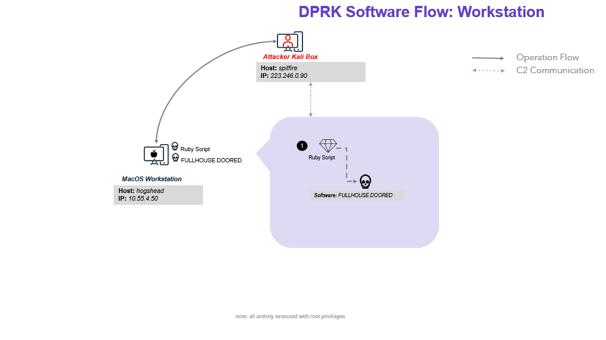
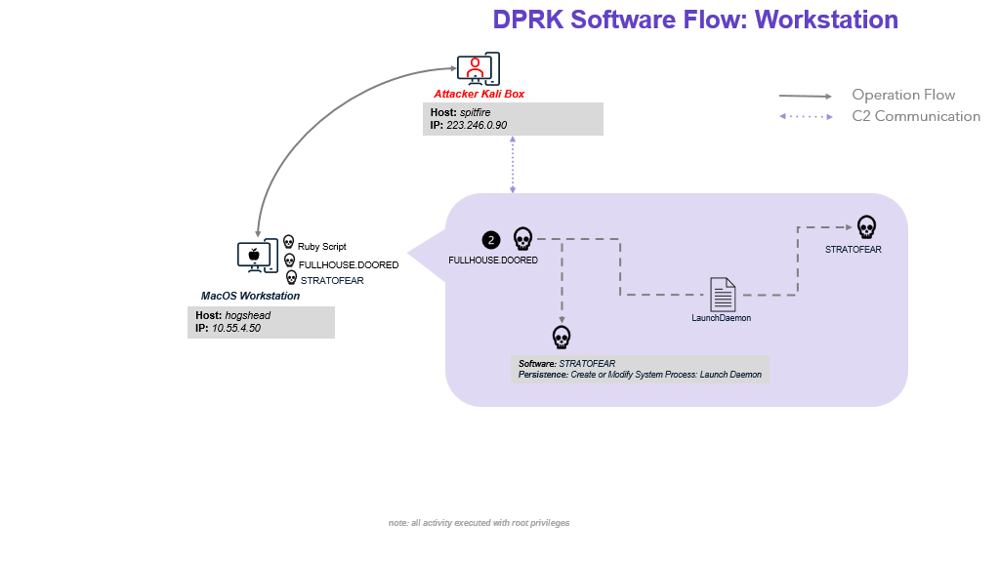
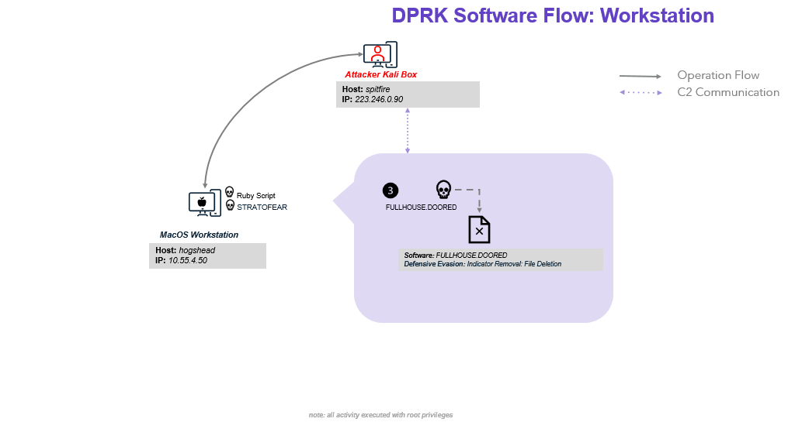
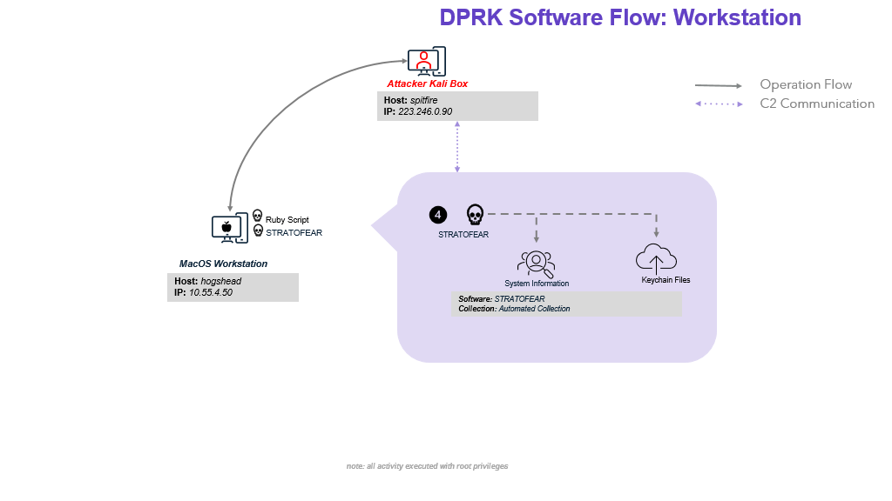

# Scenario Overview

In this scenario, a macOS device is targeted by a DPRK-affiliated adversary following a supply chain attack. With the use of multi-staged, modular malware to abuse legitimate macOS utilities and exfiltrate sensitive data. Included below is an overview of the attack sequence and major activities executed by the threat actor. For more detailed information about red team activities, please refer to the [DPRK Emulation Plan](../Emulation_Plan/ER6_DPRK_Scenario.md).

## Overview

1. This scenario begins after initial compromise, where a victim was compromised via a supply chain attack resulting in execution of a malicious Ruby script with root privileges. The Ruby script downloads two files: `/usr/local/bin/com.docker.sock` (FULLHOUSE.DOORED) and `/usr/local/bin/com.docker.sock.lock` (FULLHOUSE.DOORED configuration file). Then executes FULLHOUSE.DOORED,  a first-stage backdoor which on execution, loads the configuration file then communicate over HTTP to the C2.

    

2. Next, the threat actor uses FULLHOUSE.DOORED to setup and install STRATOFEAR, the second-stage backdoor. DPRK uses FULLHOUSE.DOORED to download STRATOFEAR and its configuration file to hogshead as `/Library/PrivilegedHelperTools/us.zoom.ZoomHelperTool` and `/Library/Fonts/pingfang.ttf.md5` respectively. FULLHOUSE.DOORED is used to create a LaunchDaemon for persistence, and the LaunchDaemon is leveraged to execute STRATOFEAR. On execution, STRATOFEAR loads its configuration file and communicates over HTTPS to the C2 address defined in the configuration file.

    

3. After installing the second-stage backdoor, the threat actor removes the first-stage backdoor. FULLHOUSE.DOORED will remove its configuration file and binary on exit.

    

4. The threat actor uses STRATOFEAR to collect system information and exfiltrate targeted Keychain files. STRATOFEAR executes a command which collects and posts the users, system, and OS information to the C2 server. STRATOFEAR then downloads a module in the form of a macOS specific dynamic library (.dylib file, similar to a .dll file for windows) Using the `0x62` command. The module is saved to disk with a random 6 alphanumeric character filename in the `/tmp` folder. Using `dlopen()` & `dlsym()` API calls, the module is loaded into STRATOFEAR's process space and executed. The module executed saves the Keychain file paths to an environment variable. STRATOFEAR then executes the 0x64 command which uploads files to the C2 server using the paths saved in the environment variables set using the dylib file. The threat actors then tasks STRATOFEAR to monitor for all devices mounted to the system using the 0x47 command.

    