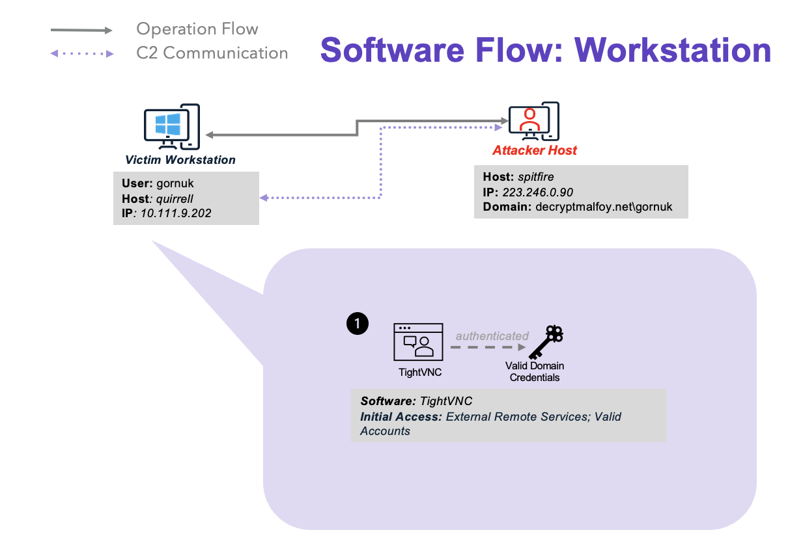
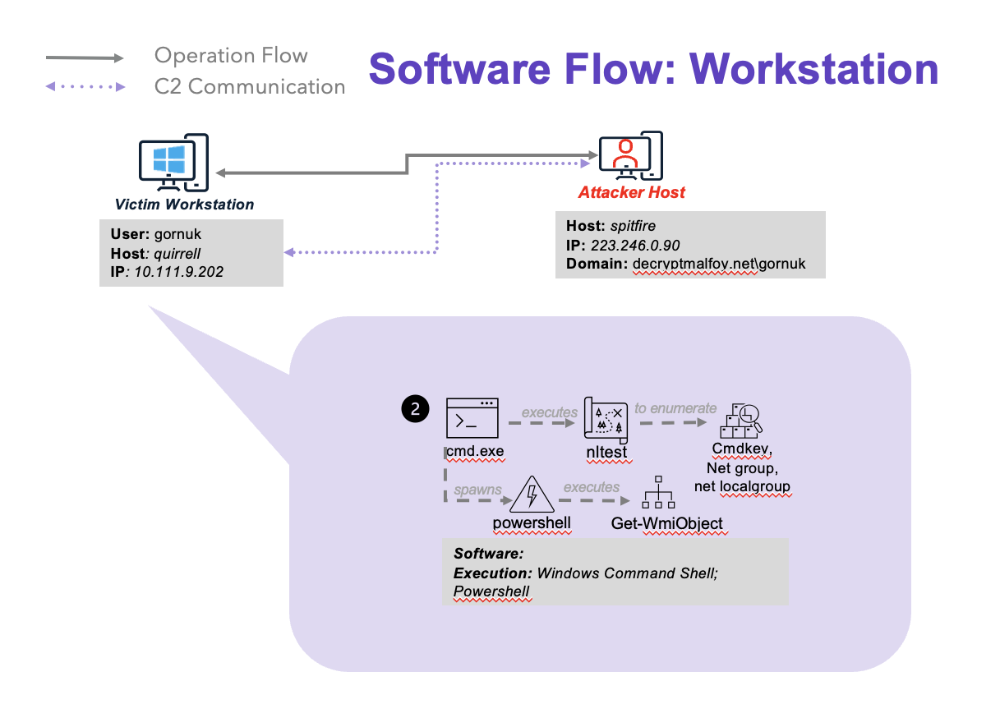
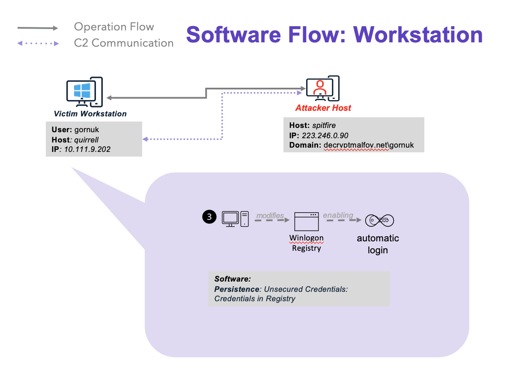
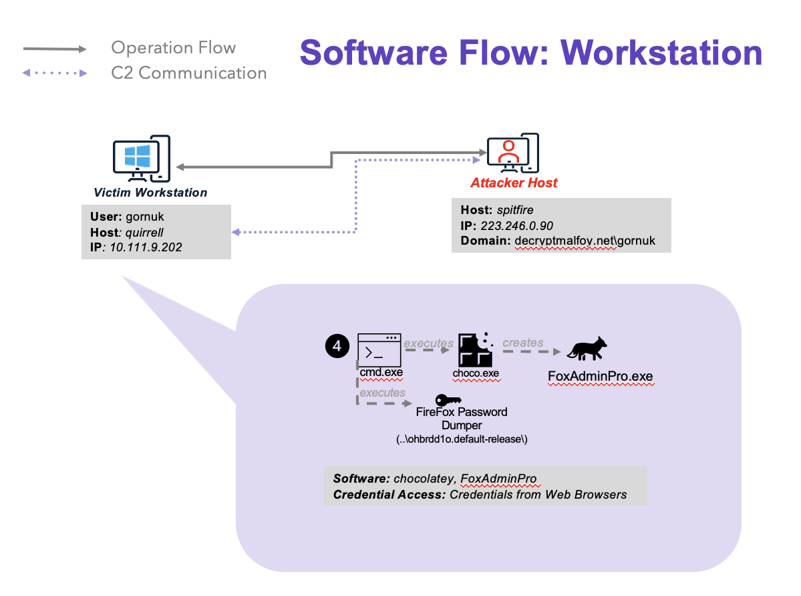
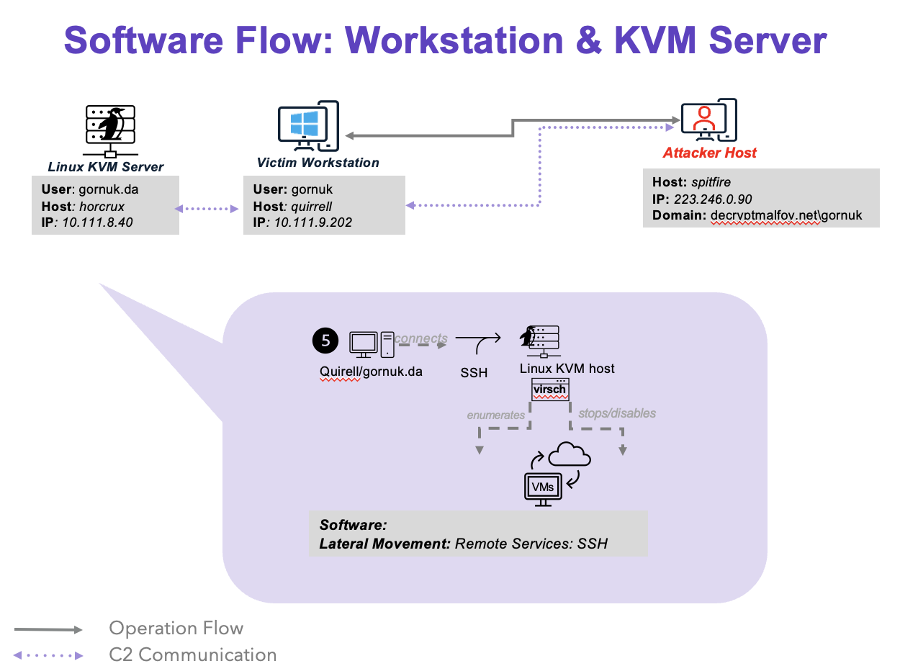
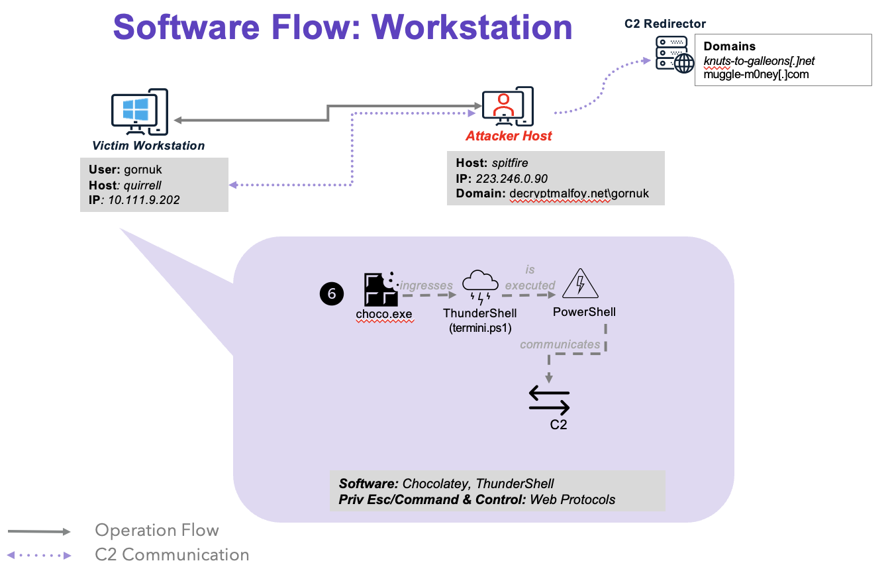
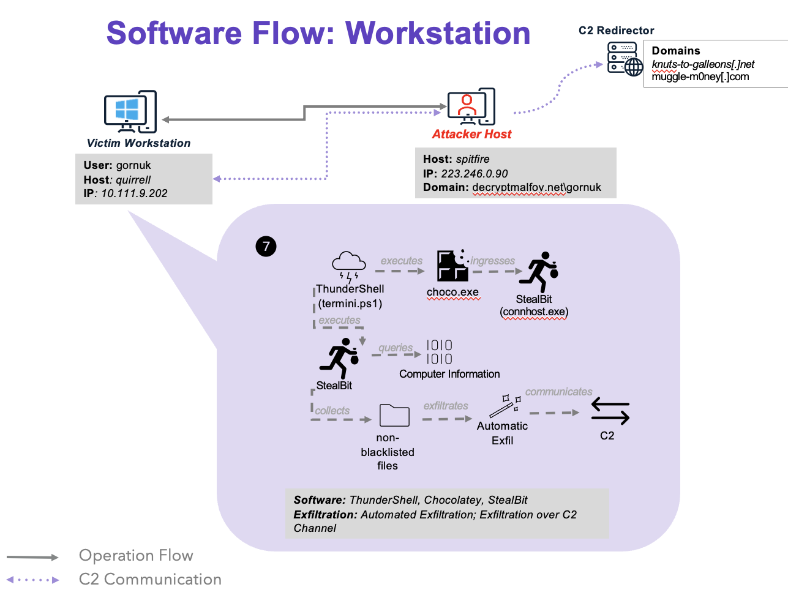
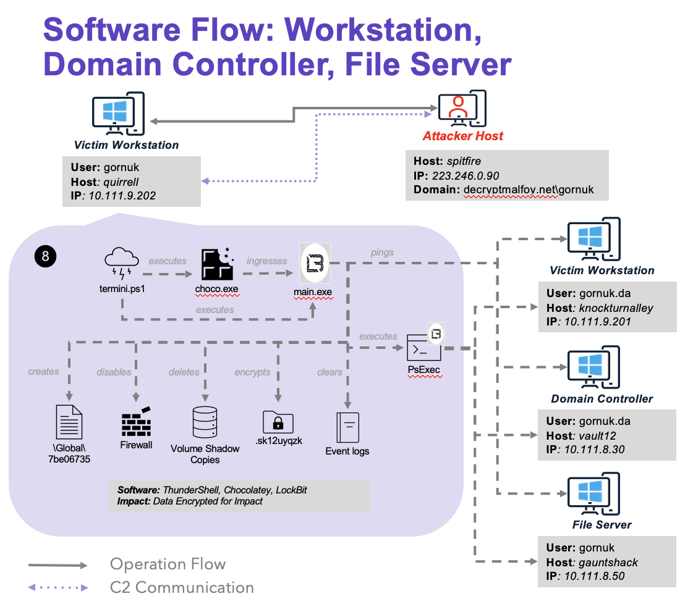

# Scenario Overview

This scenario follows a LockBit affiliate dropping LockBit onto a victim’s workstation and the subsequent theft and encryption of files. Below is an overview of the attack sequency and major activities executed by the threat actor. For more detailed information about the particular activities of the red team, please refer to the LockBit Emulation Plan.

## Overview

1. The LockBit affiliate gains initial access to the victim environment via compromised credentials. By leveraging these credentials, the threat actors gain remote VNC access to a Windows workstation.

    

2. The attackers perform discovery on the affected workstation, enumerating domain controllers, domain trusts, cached passwords, domain and local groups, and services.

    

3. In order to maintain persistence, the LockBit affiliate modifies the registry subkey to enable automatic login.

    

4. Next, the affiliate utilizes the legitimate Windows software chocolatey to ingress the Firefox password dumper. This tool will be leveraged to escalate privileges by dumping passwords from the victim’s Firefox browser, yielding domain admin credentials for a Linux KVM server on the network.

    

5. Using the domain admin credentials, the attackers obtain SSH access to the Linux KVM server. After using the elevated Command Prompt to perform discovery actions, the threat actors will then enumerate and stop virtual machines and disable autostart.

    

6. The LockBit affiliate will then seek to escalate privileges by leveraging chocolatey to ingress the PowerShell-based RAT **ThunderShell** on the affected server. The affiliate opens PowerShell with administrative privileges and executes **ThunderShell**, which establishes C2 communications over HTTP.

    

7. While utilizing **ThunderShell** to remotely access the Linus KVM server, the attackers use chocolatey to download the **StealBit** malware. **StealBit** will parse files, enumerate system information, and ultimately exfiltrate data back to the attacker-controlled C2 via HTTP PUT requests. Once the data theft is complete, the **StealBit** malware will delete itself on the victim system.

    

8. LockBit affiliates execute leverage ThunderShell to deploy chocolatey for downloading and running the ransomware payload.  LockBit gathers system and network information, checking for language allow-lists to avoid certain targets, and creating mutexes to prevent duplicate execution. The ransomware then disables the firewall by modifying registry keys, and terminating processes that could interfere with encryption. It uses PsExec for lateral movement and employs bcdedit.exe to tamper with automatic Windows recovery features. Files are encrypted using 256-bit AES, with RSA session keys stored in the registry. Targets include local drives and network shares. To achieve impact, LockBit clears Windows event logs, deletes shadow copies, and disables logging mechanisms. It alters user experience by changing desktop backgrounds, adding custom icons for encrypted files, and dropping ransom notes. Upon completion, a self-deletion mechanism ensures the binary is removed.

    
