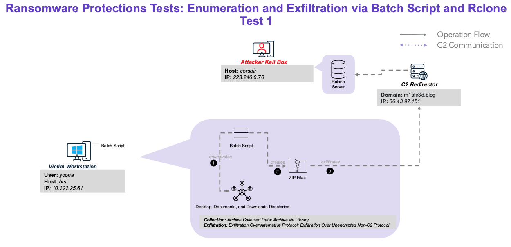
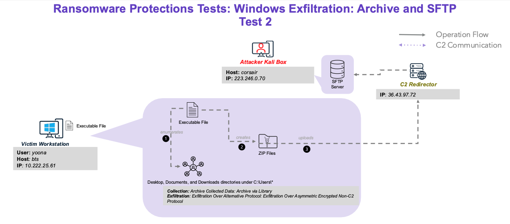
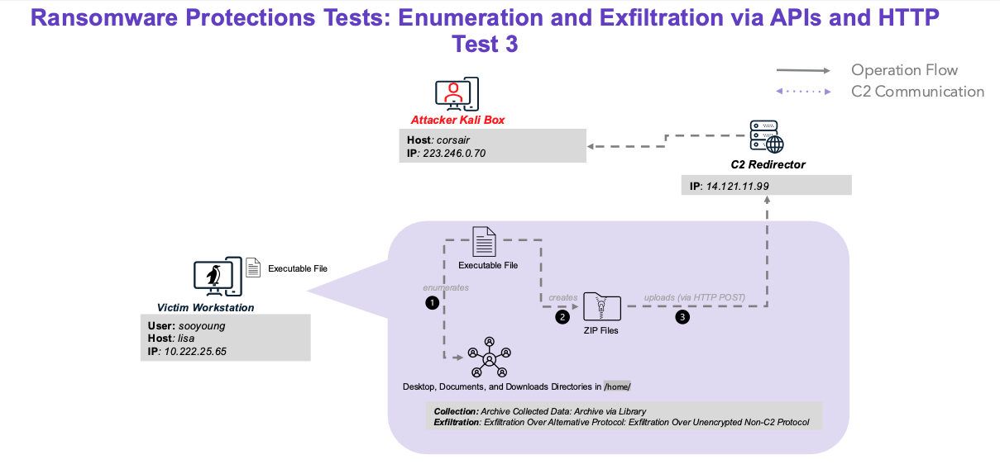
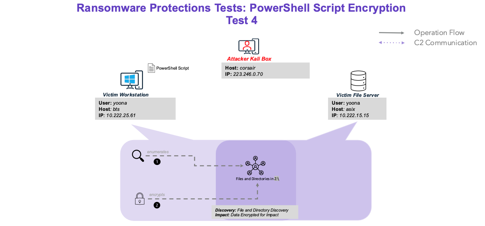
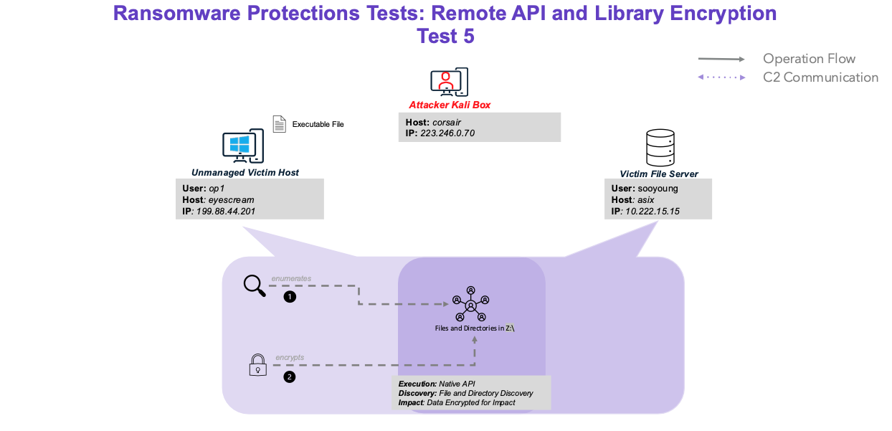
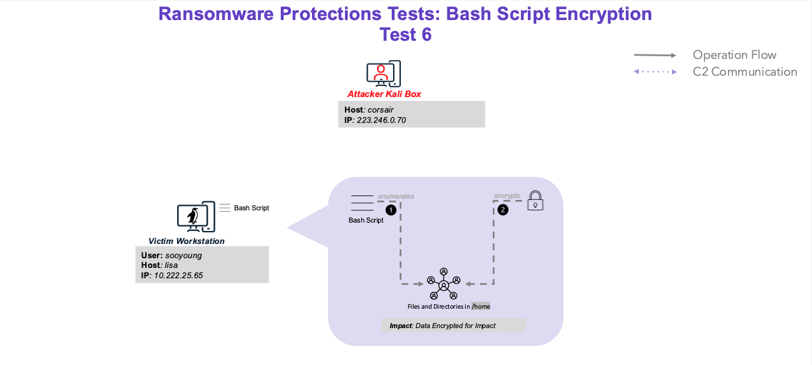
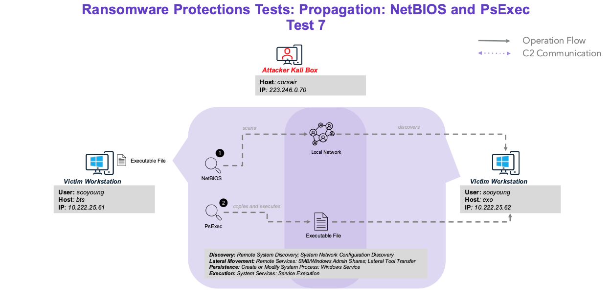
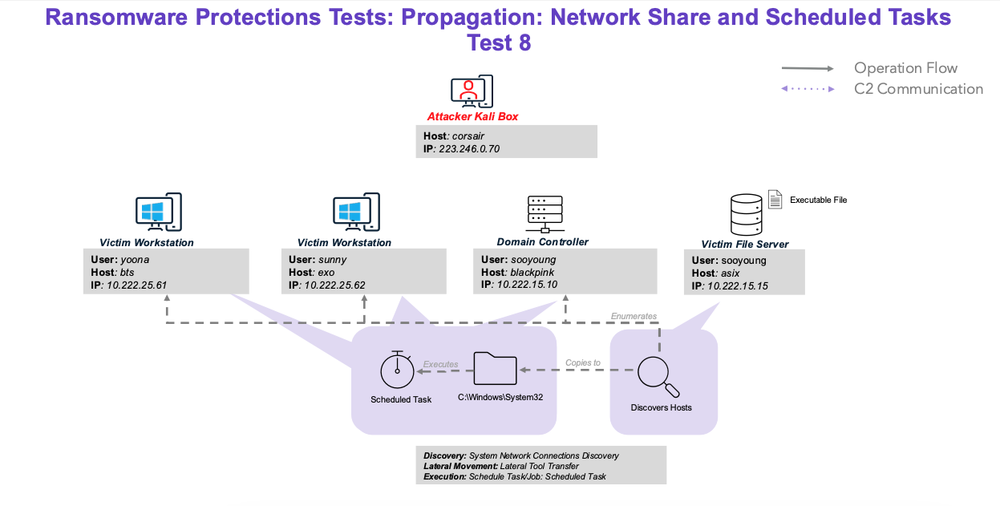
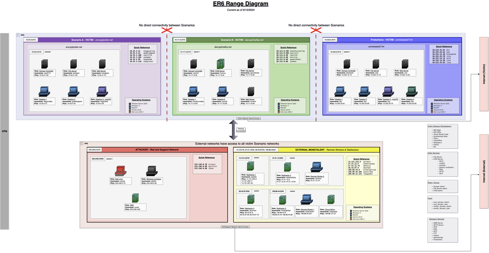

# Emulation Diagrams

## Operations Flow

## Infrastructure Diagram

> [!IMPORTANT]
> The CL0P, DPRK, and LockBit adversaries as well as the Protections micros share an infrastructure configuration.
>
> See the [setup documentation](../../../cl0p/Resources/setup/README.md) for the [CL0P](../../../cl0p/Resources/setup/README.md) adversary infrastructure setup for guidance on setting up the shared infrastructure configuration.

