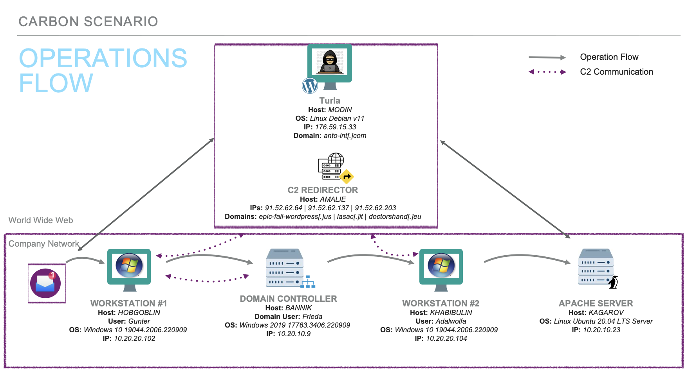

# Turla

Based on open-source intelligence, the MITRE ATT&CK &reg; Evaluations team created the below scenario leveraging techniques seen from Turla in the wild. We have adapted the scenario based on tools and resources available at the time.

## Adversary Overview ♾️🪨🧸

Active since at least the early 2000s, [Turla](https://attack.mitre.org/groups/G0010/) is a sophisticated Russian-based threat group that has infected victims in more than 50 countries.[1](https://www.cisa.gov/news-events/cybersecurity-advisories/aa23-129a) The group has targeted government agencies, diplomatic missions, military groups, research and education facilities, critical infrastructure sectors, and media organizations.[1](https://www.cisa.gov/news-events/cybersecurity-advisories/aa23-129a) [2](https://www.justice.gov/opa/pr/justice-department-announces-court-authorized-disruption-snake-malware-network-controlled)  [Turla](https://attack.mitre.org/groups/G0010/) leverages novel techniques and custom tooling and open-source tools to elude defenses and persist on target networks. [3](https://www.hhs.gov/sites/default/files/major-cyber-orgs-of-russian-intelligence-services.pdf) [4](https://media.defense.gov/2019/Oct/18/2002197242/-1/-1/0/NSA_CSA_TURLA_20191021%20VER%203%20-%20COPY.PDF) The group is also known for its adaptability and willingness to evolve behaviors and tools to achieve campaign objectives. [5](https://www.eset.com/us/about/newsroom/press-releases/cyber-espionage-group-turla-and-its-latest-malware-under-the-microscope-1/) [6](https://www.kaspersky.com/about/press-releases/2023_apt-q1-2023-playbook-advanced-techniques-broader-horizons-and-new-targets) [7](https://www.ncsc.gov.uk/static-assets/documents/Turla%20Neuron%20Malware%20Update.pdf)
[Turla](https://attack.mitre.org/groups/G0010/) is known for their targeted intrusions and innovative stealth. After establishing a foothold and conducting victim enumeration, [Turla](https://attack.mitre.org/groups/G0010/) persists with a minimal footprint through in-memory or kernel implants. [8](https://cert.gov.ua/article/5213167) [9](https://dl.acm.org/doi/pdf/10.1145/3603506) [Turla](https://attack.mitre.org/groups/G0010/) executes highly targeted campaigns aimed at exfiltrating sensitive information from Linux and Windows infrastructure.[10](https://www.welivesecurity.com/wp-content/uploads/2020/05/ESET_Turla_ComRAT.pdf) [11](https://media.kasperskycontenthub.com/wp-content/uploads/sites/43/2018/03/07180251/Penquins_Moonlit_Maze_PDF_eng.pdf)

**Associated Groups:** IRON HUNTER, Group 88, Belugasturgeon, Waterbug, WhiteBear, Snake, Krypton, Venomous Bear

## Emulation Overview 📖

This scenario follows Turla’s multi-phase intelligence collection campaign by establishing a typo-squatted website of NATO to target entities with a high value of information. During **phase one**, Turla implants a watering hole for persistence on the victim’s network as a way to compromise more targets of interest. Turla gains initial access through a spearphishing email, a fake software installer is downloaded onto the victim machine, and execution of the EPIC payload takes place. Once persistence and C2 communications are established, a domain controller is discovered, and CARBON-DLL is ingressed into victim network. Further lateral movement brings the attackers to a Linux Apache server where PENGUIN is copied to the server and used to install a watering hole.

In **phase two** of the attack, the attackers establish a typo-squatted website to target entities with high value information. The victims are prompted to update their (Not)Flash, and in doing so, EPIC is installed on their network. EPIC communicates to the C2 server via proxy web server with HTTPS requests, and SNAKE is then deployed to maintain foothold, elevate privileges and communicates to the C2 via HTTP/SMTP/DNS. Next, the attackers move laterally onto a Microsoft IIS server, install SNAKE, and create an admin account. The attackers then move laterally onto an Exchange workstation, and install SNAKE. Fianlly, they move laterally onto an Exchange Server and install LightNeuron. LIGHTNERON enables email collection and staging for exfiltrating stolen data via benign email PDF/JPG attachments. Turla proceeeds to collect and exfiltrate sensitive communications in an effort to identify new information sources and collect up-to-date information relevant to mission objectives.

## Quick Links

### For Engineers 🧑‍💻

### Resources

The [Resources Folder](./Resources/) contains the emulated software source code.

The [Binaries.zip](./Resources/Binaries/binaries.zip) contains scenario payloads in
one zip file for easy download. The password is `malware`.

> **NOTE:** The Snake installer has not been included in this zip and must be
> recompiled.

All other pre-built executables have been removed. To rebuild the binaries,
follow the documentation for the respective binary.

This scenario also utilizes `Mimikatz`, `Plink`, `Pscp`, and `PsExec` as payloads:

1. [mimikatz](https://github.com/gentilkiwi/mimikatz/releases)
1. [plink.exe](https://the.earth.li/~sgtatham/putty/latest/w64/plink.exe)
1. [pscp.exe](https://the.earth.li/~sgtatham/putty/latest/w64/pscp.exe)
1. [PsExec](https://learn.microsoft.com/en-us/sysinternals/downloads/psexec)

### YARA Rules

[YARA rules](./yara-rules) are provided to assist the community in researching, preventing, and detecting malware specimens used in this emulation plan.

### Emulation Key Software 💻

- [EPIC](./Resources/EPIC/)

- [Carbon](./Resources/Carbon/)

- [Keylogger](./Resources/Keylogger/)

- [Penquin](./Resources/Penquin/)

- [Snake](./Resources/Snake/)

- [LightNeuron](./Resources/LightNeuron/)

### Scenario Walkthrough

- [Carbon Detection Scenario](./Emulation_Plan/Carbon_Scenario/Carbon_Detections_Scenario.md) - Step by step walkthrough of Carbon Detection Scenario's procedures (10 steps)
- [Snake Detection Scenario](./Emulation_Plan/Snake_Scenario/Snake_Detections_Scenario) - Step by step walkthrough of Snake Scenario's procedures (9 steps)
- [Carbon Protection Scenario](./Emulation_Plan/Carbon_Scenario/Carbon_Protections_Scenario.md) - Step by step walkthrough of Carbon Protection Scenario's procedures (7 tests)
- [Snake Protection Scenario](./Emulation_Plan/Snake_Scenario/Snake_Protections_Scenario.md) - Step by step walkthrough of Snake Protection Scenario's procedures (6 tests)

## For Analysts 🔎

- [Carbon Operation Flow](./Operations_Flow/Carbon_Operations_Flow.md/) - High-level summary of the Carbon scenario & infrastructure with diagrams.
- [Snake Operation Flow](./Operations_Flow/Snake_Operations_Flow.md/) - High-level summary of the Snake scenario & infrastructure with diagrams.
- [Intelligence Summary](./Intelligence_Summary/Intelligence_Summary.md) - General overview of the Adversary with links to reporting used throughout the scenario.

## Acknowledgements

We would like to formally thank the people that contributed to the content, review, and format of this document. This includes the MITRE ATT&CK and MITRE ATT&CK Evaluations teams, the organizations and people that provided public intelligence and resources, as well as the following organizations that participated in the community cyber threat intelligence contribution process:   - Microsoft   - CrowdStrike

## Connect with us 🗨️

We 💖 feedback! Let us know how using ATT&CK Evaluation results has helped you and what we can do better.

Email: <evals@mitre.org> 
Twitter: <https://x.com/MITREcorp> 
LinkedIn: <https://www.linkedin.com/showcase/attack-evaluations/> 

## Liability / Responsible Usage

This content is only to be used with appropriate prior, explicit authorization for the purposes of assessing security posture and/or research.

## Notice

© 2023 MITRE Engenuity. Approved for Public Release. Document number CT0005.

Licensed under the Apache License, Version 2.0 (the "License"); you may not use this file except in compliance with the License. You may obtain a copy of the License at

<http://www.apache.org/licenses/LICENSE-2.0>

Unless required by applicable law or agreed to in writing, software distributed under the License is distributed on an "AS IS" BASIS, WITHOUT WARRANTIES OR CONDITIONS OF ANY KIND, either express or implied. See the License for the specific language governing permissions and limitations under the License.

This project makes use of ATT&CK®

[ATT&CK Terms of Use](https://attack.mitre.org/resources/terms-of-use/)
