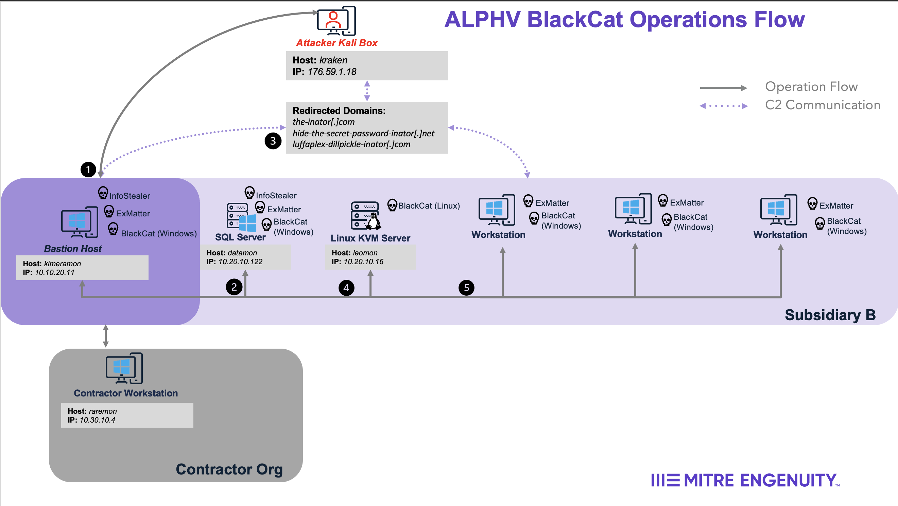
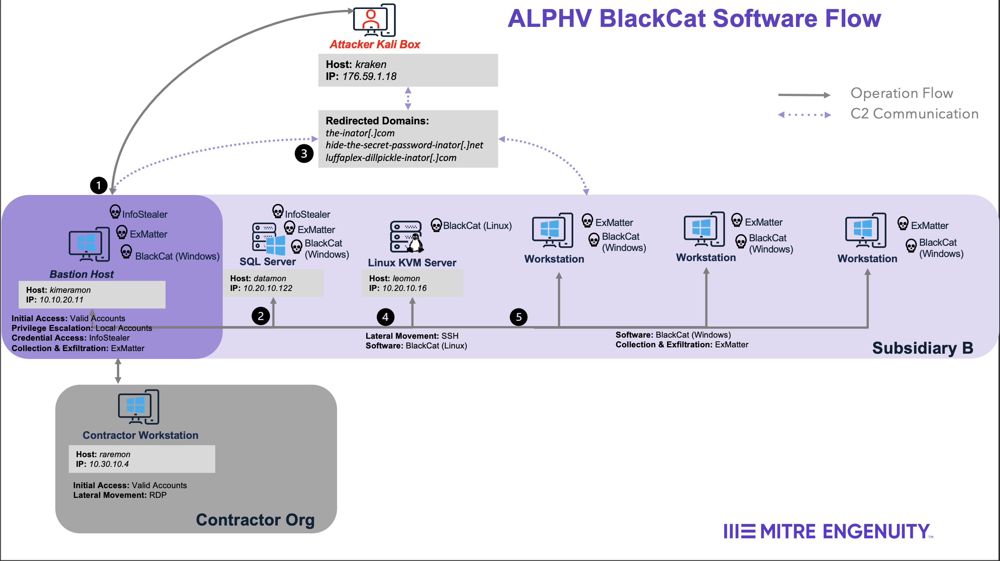
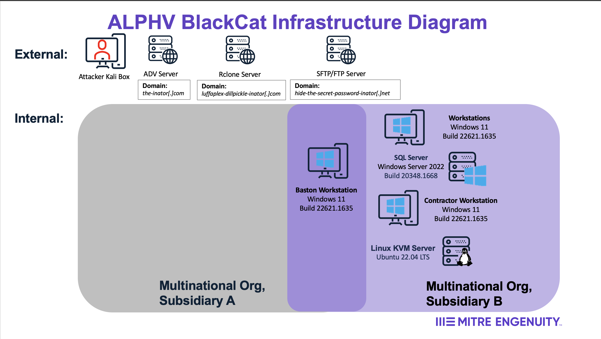
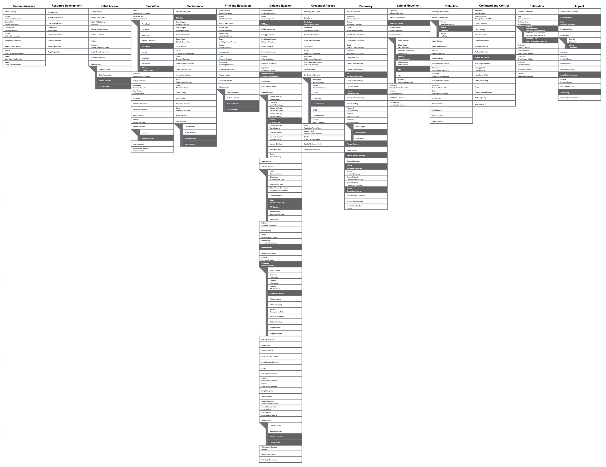

# Scenario Diagrams

This scenario involved an ALPHV BlackCat affiliate orchestrating an attack against the subsidiary of a fictitious global pharmaceutical company. Below are diagrams depicting the affiliate's attack sequence and the major activities executed. An [Operations Flow](#operations-flow), [Software Flow](#software-flow), [Infrastructure Diagram](#infrastructure-diagram) and [Technique Scope](#technique-scope). For the detailed emulation plan, refer to the ([ALPHV BlackCat Emulation Plan](../Emulation_Plan/ALPHV_BlackCat_Scenario.md)).

## Operations Flow

## Software Flow

## Infrastructure Diagram

## Technique Scope

