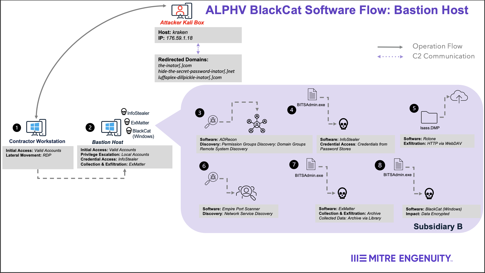
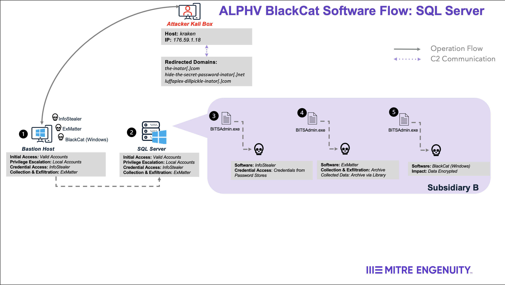
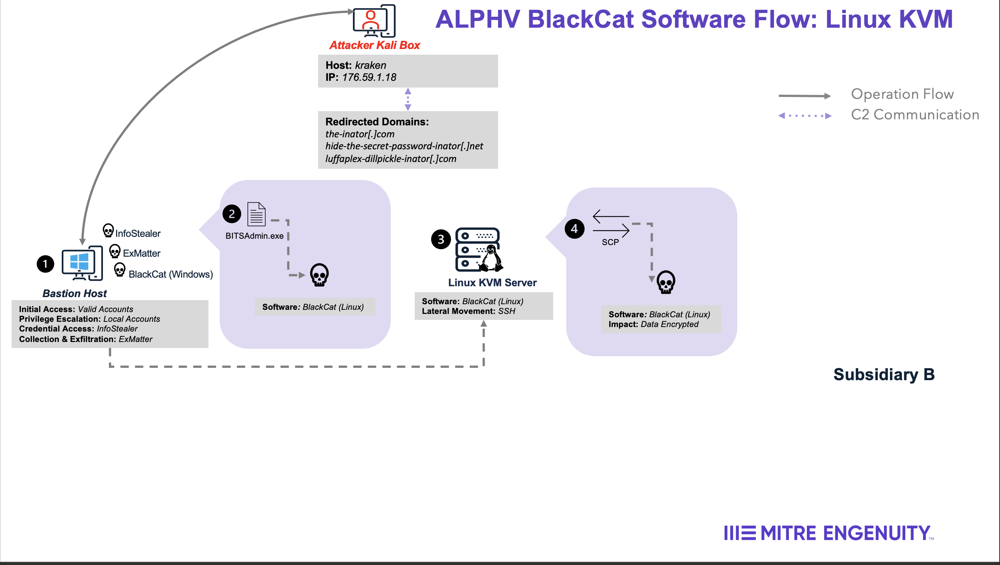

# Scenario Overview

This scenario involved an ALPHV BlackCat affiliate orchestrating an attack against the subsidiary of a fictitious global pharmaceutical company. Included below is a diagram outlining the attack sequence and major activities executed. For the detailed emulation plan, refer to the ([ALPHV BlackCat Emulation Plan](../Emulation_Plan/ALPHV_BlackCat_Scenario.md)).

## Overview

1. An Initial Access Broker gains access to a contractor organization, and provides an ALPHV BlackCat affiliate with RDP access to the organization’s network. The discovery of _kimeramon_, a bastion workstation, makes way for the affiliate to access the corporate subsidiary network through trusted access (`Step 1-2 of Bastion Host Diagram`). Next the affiliate downloads **ADRecon.ps1**, and uses it for discovery on Active Directory and the corporate network. The ADRecon output contains information about a backup server _datamon_, Linux KVM server _leomon_ and server administrators (`Step 3 of Bastion Host Diagram`).

2. Next, the affiliate discovers SQL Server Management Studio installed on _kimeramon_ and uses BITSAdmin.exe to download **InfoStealer** then executes **InfoStealer** against _kimeramon_ to obtain plaintext credentials for the backup admin account (`Step 4 of Bastion Host Diagram`). The compromised credentials are used to access the backup server and execute **InfoStealer** against the NetBNMBackup server _datamon_ (`Step 3 of SQL Server Diagram`). The decrypted output contains the plaintext passwords for: the workstation local administrator account _windesk_, Linux KVM server administrator account _marakawa_, and the domain admin account _ykaida.da_. Using _windesk_, the affiliate utilizes several methods in an attempt to disable anti-virus and EDR solutions on the bastion host.

3. The affiliate utilizes _windesk_ credentials and the RDP session on **kimeramon** to edit the registry and enable WDigest. The affiliate then dumps credentials via Task Manager and exfiltrates the dump file using **rclone**(`Step 5 of Bastion Host Diagram`).

4. The compromised domain admin account _ykaida.da_ is used to download **ExMatter** and a network scanning script to identify additional targets via PowerShell (`Step 6-7 of Bastion Host Diagram`). The affiliate uses PsExec to execute **ExMatter** against the identified targets to exfiltrate data. After remote execution of **ExMatter**, the affiliate executes ExMatter on the local workstation.

5. The affiliate downloads **ALPHV BlackCat Ransomware (Linux)** to _kimeramon_, uses SCP to copy **ALPHV BlackCat Ransomware (Linux)** to _leomon_ and sends an SSH command to the Linux KVM server to execute (`Step 1-4 of Linux KVM Diagram`).

6. Next, the affiliate downloads **ALPHV BlackCat Ransomware (Windows)** to _kimeramon_ (`Step 8 of Bastion Host Diagram`) and provides the Domain Admin credentials to run the executable with administrative privileges. After encryption, ALPHV BlackCat Ransomware changes wallpaper for logged-in users to an image of the ransom note, unmounts previously mounted partitions, deletes volume shadow copies again, and lists and clears Windows Event logs via API calls.

