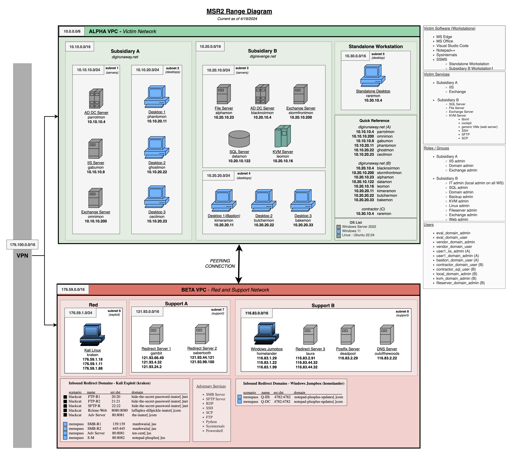

# Infrastructure for [ATT&CK Evaluations](https://attackevals.mitre-engenuity.org/) - ALPHV BlackCat and menuPass (2024)

The infrastructure below was used for both ALPHV BlackCat and menuPass (2024). For convenience and cost savings, shared resources are used, including supporting infrastructure, including attacker platform, DNS, mail server, and traffic forwarding hosts.

Initial infrastructure was setup using Terraform, with configuration applied via scripts and configuration files.

-------

- [Infrastructure for ATT\&CK Evaluations - ALPHV BlackCat and menuPass (2024)](#infrastructure-for-attck-evaluations---alphv-blackcat-and-menupass-2024)
  - [Infrastructure Overview](#infrastructure-overview)
    - [Scenario VMs](#scenario-vms)
      - [Subsidiary A Domain - digirunaway.net](#subsidiary-a-domain---digirunawaynet)
      - [Subsidiary B Domain - digirevenge.net](#subsidiary-b-domain---digirevengenet)
      - [Standalone Workstation](#standalone-workstation)
    - [Support and Red Team Hosts](#support-and-red-team-hosts)
      - [Network Support Hosts](#network-support-hosts)
      - [Red Team Hosts](#red-team-hosts)
    - [Network Diagram](#network-diagram)

## Infrastructure Overview

This document provides an overview of the infrastructure support used for the evaluation. In addition to setup and configuration of virtual machines, this document covers infrastructure support services, such as domain name services (DNS), mail, and traffic redirection, used to support the evaluation. Support services such as DNS and redirectors are used throughout the evaluation for resource efficiency.

The [Digimon media franchise](https://en.wikipedia.org/wiki/Digimon) was used as inspiration for the naming scheme.

### Scenario VMs

The scenario consists of an organization with two subsidiaries, with a bidirectional Active Directory domain trust relationship between the domains.  A separate workstation, outside of the two domains, represents a 3rd party user with trusted access to the domain systems.

#### Subsidiary A Domain - digirunaway.net

The Subsidiary A domain consists of six virtual machines, all joined to the `digirunaway.net` Windows domain.

| **Hostname** | **OS**              | **IP**         | **Role**          |
| :----------- | :------------------ | :------------- | :---------------- |
| `parrotmon`  | Windows Server 2022 | `10.10.10.4`   | Domain Controller |
| `omnimon`    | Windows Server 2022 | `10.10.10.200` | Exchange Server   |
| `gabumon`    | Windows Server 2022 | `10.10.10.9`   | IIS Server        |
| `phantomon`  | Windows 11          | `10.10.20.11`  | Workstation 1     |
| `ghostmon`   | Windows 11          | `10.10.20.22`  | Workstation 2     |
| `cecilmon`   | Windows 11          | `10.10.20.23`  | Workstation 3     |

#### Subsidiary B Domain - digirevenge.net

The Subsidiary B domain consists of eight virtual machines, all joined to the `digirevenge.net` Windows domain.

| **Hostname**    | **OS**              | **IP**         | **Role**                                       |
| :-------------- | :------------------ | :------------- | :--------------------------------------------- |
| `blacknoirmon`  | Windows Server 2022 | `10.20.10.4`   | Domain Controller                              |
| `stormfrontmon` | Windows Server 2022 | `10.20.10.200` | Exchange Server                                |
| `alphamon`      | Windows Server 2022 | `10.20.10.23`  | File Server                                    |
| `datamon`       | Windows Server 2022 | `10.20.10.122` | SQL Server                                     |
| `kimeramon`     | Windows 11          | `10.20.20.11`  | Workstation 1 (Bastion)                        |
| `butchermon`    | Windows 11          | `10.20.20.22`  | Workstation 2                                  |
| `bakemon`       | Windows 11          | `10.20.20.33`  | Workstation 3                                  |
| `leomon`        | Ubuntu 22.04 LTS    | `10.20.10.16`  | KVM Server (uses Active Directory credentials) |

#### Standalone Workstation

The Standalone Workstation is a single virtual machine, not joined to an Active Directory domain.

| **Hostname** | **OS**     | **IP**       | **Role**               |
| :----------- | :--------- | :----------- | :--------------------- |
| `raremon`    | Windows 11 | `10.30.10.4` | Contractor Workstation |

### Support and Red Team Hosts

The following hosts are used for overall network support, as well as for red team use. The hosts below are not accessible by evaluation participants.

#### Network Support Hosts

| **Hostname**    | **OS**           | **IP**                                     | **Role**     |
| :-------------- | :--------------- | :----------------------------------------- | :----------- |
| `outofthewoods` | Ubuntu 22.04 LTS | `116.83.2.22`                              | DNS          |
| `deadpool`      | Ubuntu 22.04 LTS | `116.83.2.29`                              | Postfix Mail |
| `gambit`        | Ubuntu 22.04 LTS | `121.93.4.32`,`121.93.66.4`,`121.93.24.2`  | Redirector 1 |
| `sabertooth`    | Ubuntu 22.04 LTS | `121.93.44.121`,`121.93.99.100`            | Redirector 2 |
| `laura`         | Ubuntu 22.04 LTS | `116.83.44.32`,`116.83.2.91`,`116.83.4.99` | Redirector 3 |
|                 |                  |                                            |              |

#### Red Team Hosts

| **Hostname** | **OS**              | **IP**        | **Role** |
| :----------- | :------------------ | :------------ | :------- |
| `homelander` | Windows Server 2022 | `116.83.1.29` | Jumpbox  |
| `kraken`     | Kali Linux 2023.4   | `176.59.1.18` | Kali     |

### Network Diagram

The diagram below shows the layout of all victim hosts, attack platform, and support hosts.

