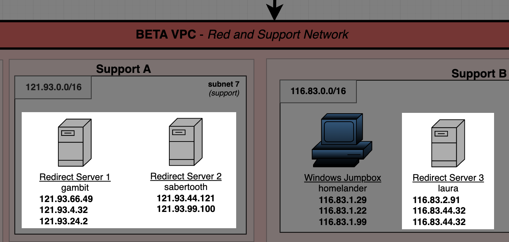
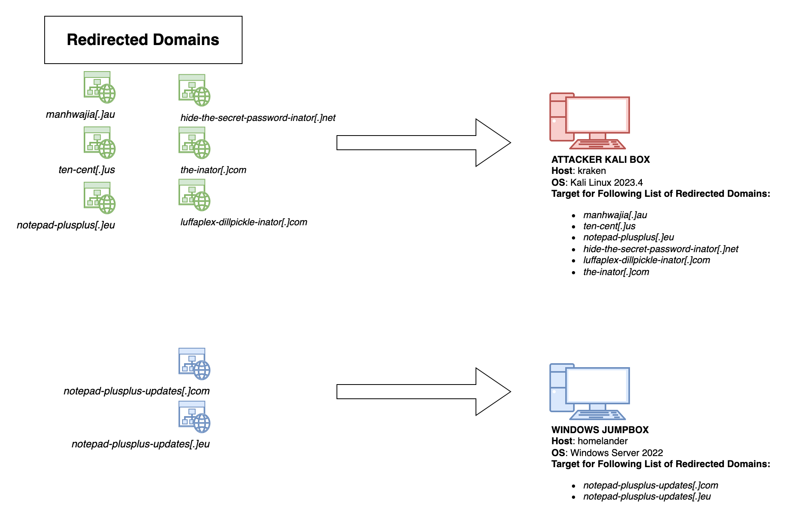

# Traffic Redirectors

- [Traffic Redirectors](#traffic-redirectors)
  - [Overview](#overview)
  - [Table of URLs and IPs used by Redirectors](#table-of-urls-and-ips-used-by-redirectors)
  - [Redirector-Specific Infrastructure Diagram](#redirector-specific-infrastructure-diagram)
  - [Redirector Logical Overview](#redirector-logical-overview)

## Overview

Multiple redirectors are used to distribute the traffic across subnets and IP address ranges.

Traffic redirection is performed using [iptables](https://www.netfilter.org/) NAT masquerading, with traffic sent to specific destination IP address and port combinations being redirected to a specific IP address and port. Scripts in the ansible/playbooks/files/ folder provide the following functionality:

1. `enable-traffic-forwarding-rules-redirect-[n].sh`
   1. Running the script on a server will configures network forwarding rules.
2. `disable-traffic-forwarding-rules.sh`
   1. Running the script on a server will disable and clear any network forwarding rules in place.
3. `print-traffic-forwarding-rules.sh`
   1. Running the script will print to stdout any network forwarding rules currently configured.

## Table of URLs and IPs used by Redirectors

| Redirector Host | Scenario | **Inbound Redirection Domain**          | **Inbound Redirection Source IP** | **Inbound Redirection Source Port** | **Destination Host/IP** | **Destination Port** | **TCP/UDP** | **Notes**                                    |
| --------------- | :------- | :-------------------------------------- | :-------------------------------- | :---------------------------------- | :---------------------- | :------------------- | :---------- | :------------------------------------------- |
| gambit          | menuPass | `manhwajia[.]au`                        | `121.93.24.2`                     | 445                                 | kraken                  | 445                  | TCP         | SMB Redirector                               |
| gambit          | menuPass | `manhwajia[.]au`                        | `121.93.24.2`                     | 139                                 | kraken                  | 139                  | TCP         | SMB Redirector                               |
| gambit          | menuPass | `ten-cent[.]us`                         | `121.93.66.4`                     | 80                                  | kraken                  | 8081                 | TCP         | Adversary HTTP Server                        |
| gambit          | menuPass | `notepad-plusplus-updates[.]com`        | `121.93.4.32`                     | 4782                                | homelander              | 4782                 | TCP         | Quasar (Running on IIS)                      |
| sabertooth      | menuPass | `notepad-plusplus-updates[.]eu`         | `121.93.99.100`                   | 4782                                | homelander              | 4782                 | TCP         | Quasar (Running on DC)                       |
| sabertooth      | menuPass | `notepad-plusplus[.]eu`                 | `121.93.44.121`                   | 80                                  | kraken                  | 8082                 | TCP         | SodaMaster                                   |
| laura           | BlackCat | `luffaplex-dillpickle-inator[.]com`     | `116.83.4.99`                     | 8080                                | kraken                  | 8080                 | TCP         | Rclone WebDAV                                |
| laura           | BlackCat | `the-inator[.]com`                      | `116.83.2.91`                     | 80                                  | kraken                  | 8081                 | TCP         | Adversary HTTP Server                        |
| laura           | BlackCat | `hide-the-secret-password-inator[.]net` | `116.83.44.32`                    | 22                                  | kraken                  | 22                   | TCP         | SFTP Redirector - ExMatter                   |
| laura           | BlackCat | `hide-the-secret-password-inator[.]net` | `116.83.44.32`                    | 20                                  | kraken                  | 20                   | TCP         | FTP Redirector - ExMatter (Alternative Step) |
| laura           | BlackCat | `hide-the-secret-password-inator[.]net` | `116.83.44.32`                    | 21                                  | kraken                  | 21                   | TCP         | FTP Redirector - ExMatter (Alternative Step) |

## Redirector-Specific Infrastructure Diagram

## Redirector Logical Overview

