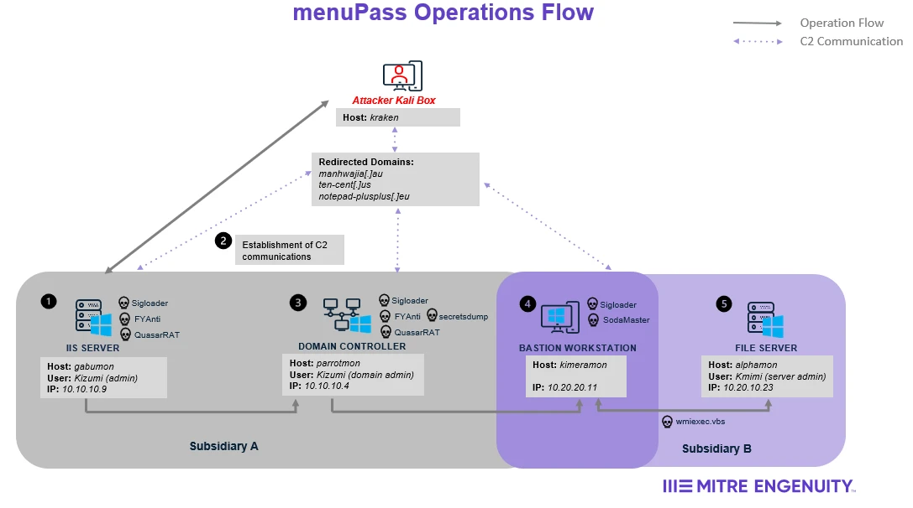
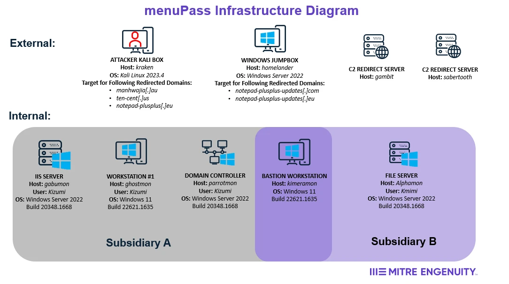
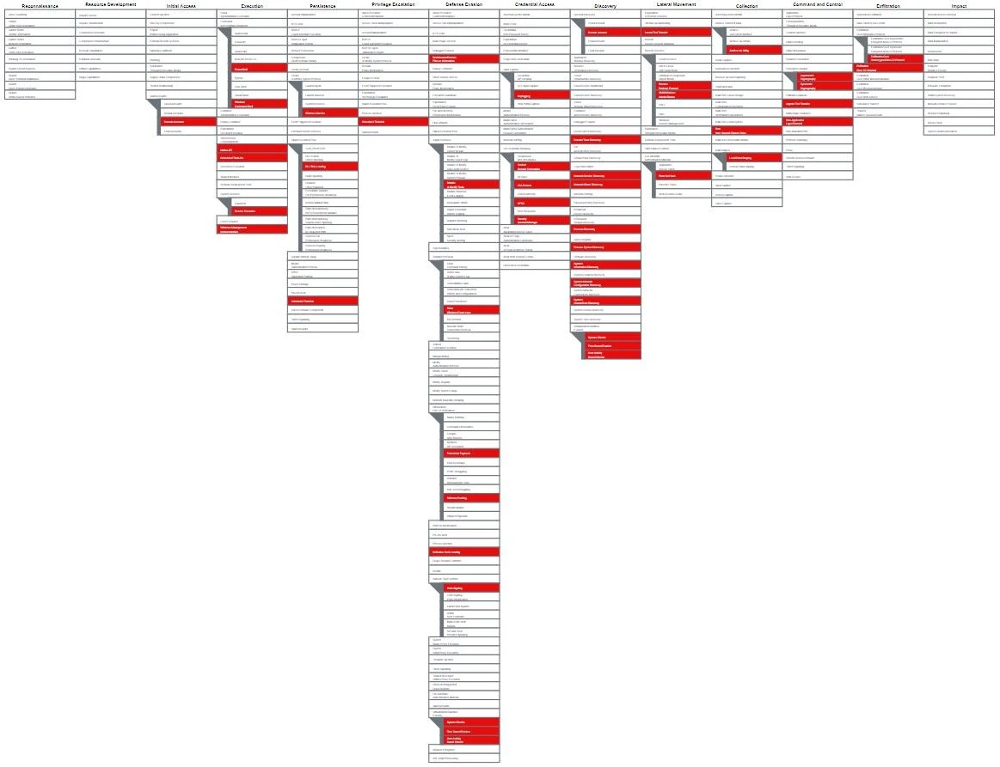

# Scenario Diagrams

This scenario involved menuPass orchestrating an attack against two subsidiaries of a fictitious global pharmaceutical company. Below is an overview of the attack sequence and major activities executed by the threat actor. A [Operations Flow](#operations-flow), [Infrastructure Diagram](#infrastructure-diagram) and [Technique Scope](#technique-scope). For more detailed information about the exact activities of the red team, please refer to the [menuPass Emulation Plan](../Emulation_Plan)).

## Operations Flow

## Infrastructure Diagram

## Technique Scope

