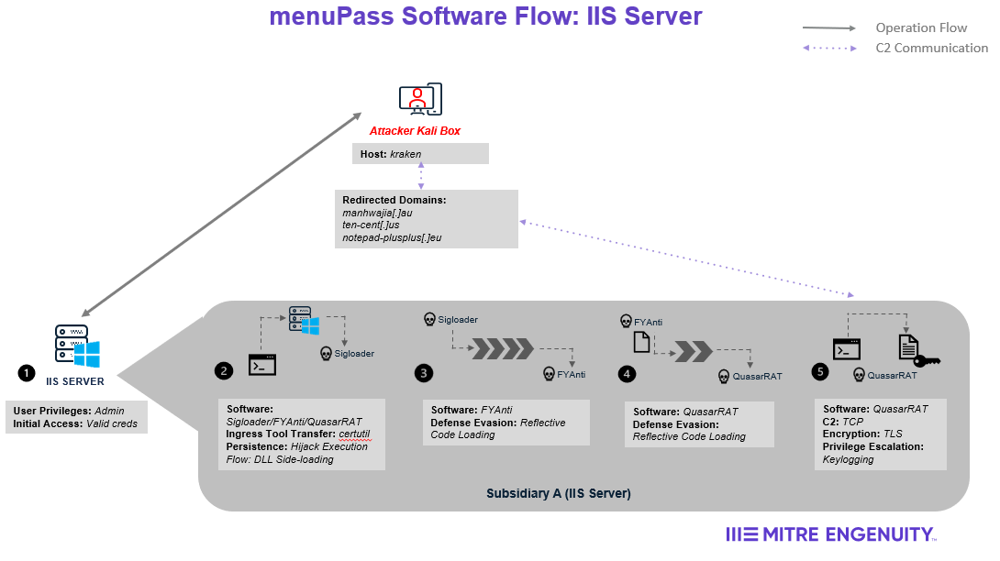
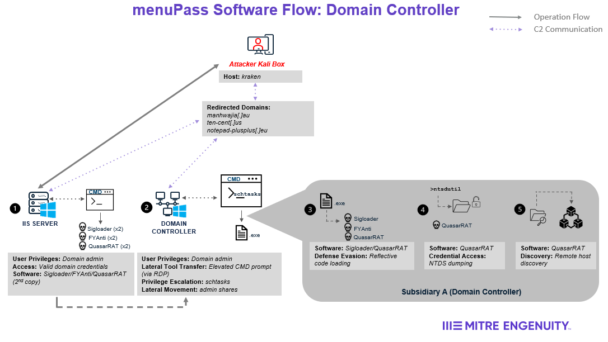
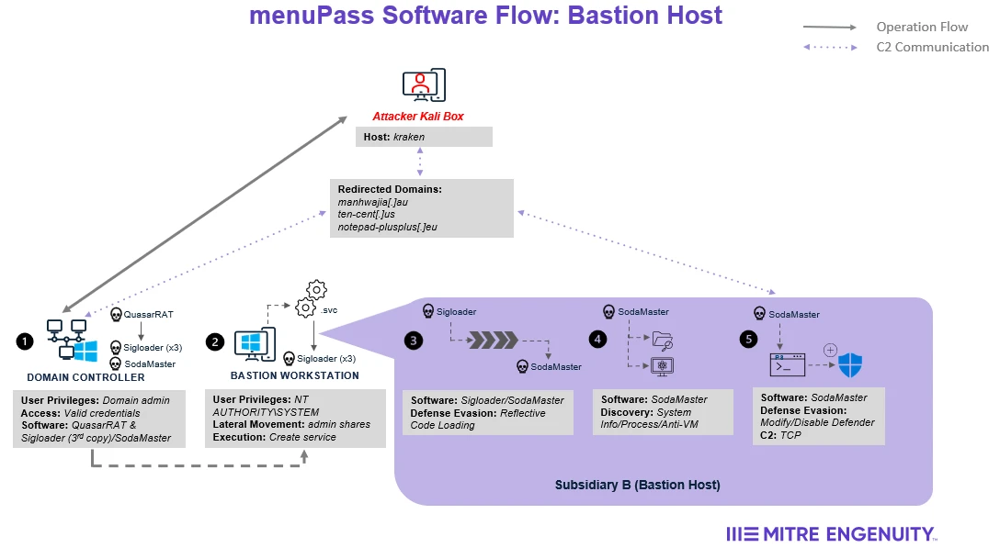
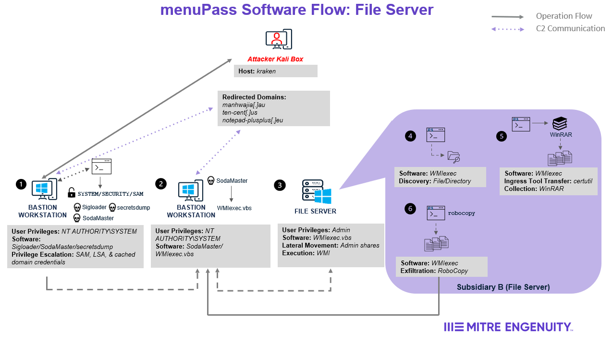

# Scenario Overview

This scenario involved menuPass orchestrating an attack against two subsidiaries of a fictitious global pharmaceutical company. Below is an overview of the attack sequence and major activities executed by the threat actor. For more detailed information about the exact activities of the red team, please refer to the [menuPass Emulation Plan](../Emulation_Plan/MSR2_menuPass_Scenario.md).

## Overview

1. menuPass begins by using previously stolen credentials from local admin user Kizumi to remotely access the Microsoft IIS web server on Subsidiary A’s network (`Step 1 of IIS Server Diagram`). The threat actor will then drop the multi-stage loader malware **SigLoader**, which loads the first payload, **FYAnti**  (`Step 2-3 of IIS Server Diagram`). **FYAnti** will then execute the open-source RAT, **QuasarRAT**, on the server (`Step 4 of IIS Server Diagram`). **QuasarRAT** checks for internet connectivity then connects to the C2 server and begins logging keystrokes (`Step 5 of IIS Server Diagram`).
2. Once C2 communications have been established, the threat actor will leverage **QuasarRAT** to perform discovery on the IIS server. As a result, the adversary discovers a domain controller on Subsidiary A's network.
3. Next, menuPass observes user _Kizumi_ logging into the IIS server. While she is working, _Kizumi_ is prompted to enter her domain admin credentials, which will be captured by the adversary via **QuasarRAT**’s keylogger (`Step 5 of IIS Server Diagram`).

4. To prepare to move laterally onto the domain controller, the threat actor downloads a second copy of **SigLoader**, **FYAnti**, and **QuasarRAT** on the IIS server (`Step 1 of Domain Controller Diagram`). By using PowerShell with _Kizumi_’s credentials, the threat actor moves the malware to the domain controller then creates and runs a scheduled task (`Step 2 of Domain Controller Diagram`). This scheduled task is utilized to DLL sideload **SigLoader** and execute **QuasarRAT** on the domain controller. (`Step 2-3 of Domain Controller Diagram`).
5. Once **QuasarRAT** establishes C2 communications on the domain controller, menuPass dumps credentials via NTDS and exfiltrates the output (`Step 4 of Domain Controller Diagram`). The threat actor analyzes the dump offline to retrieve plaintext passwords for domain users. menuPass then conducts an internal port scan to search for open RDP and SMB ports on the network. As a result, the threat actor discovers the bastion workstation, which is located in Subsidiary B’s network with access to Subsidiary A’s network (`Step 5 of Domain Controller Diagram`).

6. Next, menuPass uses **QuasarRAT** on the domain controller, which is running with domain administrator privileges, to download **SigLoader** and **SodaMaster** to the bastion workstation (`Step 1 of Bastion Host Diagram`). The threat actor then remotely creates a service on the bastion workstation that will execute a legitimate binary to sideload **SigLoader** (`Step 2 of Bastion Host Diagram`).

7. The threat actor then executes the remotely created service which DLL sideloads **SigLoader**, which loads the **SodaMaster** payload (`Step 3 of Bastion Host Diagram`). On execution, **SodaMaster** performs automated discovery, anti-sandbox checks, and modifies the host’s Windows Defender whitelist (`Steps 4-5 of Bastion Host Diagram`). As a result, menuPass notices the presence of a file server on Subsidiary B’s network.

8. The threat actor then observes user _Kmimi_ accessing the bastion host to perform tasks. _Kmimi_ is a file server administrator on Subsidiary B’s network. To prepare to move laterally onto this server, the threat actor uses **secretsdump** to dump credentials from Security Account Manager (SAM), Local Security Authority (LSA), and cached domain credentials, which is cracked offline to retrieve _Kmimi’s_ admin credentials (`Step 1 of File Server Diagram`).
9. In order to pivot onto the file server, menuPass downloads **WMIexec.vbs** onto the bastion workstation (`Step 2 of File Server Diagram`). menuPass then downloads **WMIexec.vbs** onto the workstation, and accesses the bastion workstation via RDP using _Kmimi’s_ previously retrieved credentials to execute **WMIexec.vbs**, establishing a reverse shell to the file server (`Step 3 of File Server Diagram`). Using the reverse shell, menuPass executes PowerShell to enumerate files(`Step 4 of File Server Diagram`). After the desired data has been found, the threat actor compresses the desired data via WinRAR and exfiltrates it via RoboCopy to an adversary controlled network share (`Steps 5-6 of File Server Diagram`).

