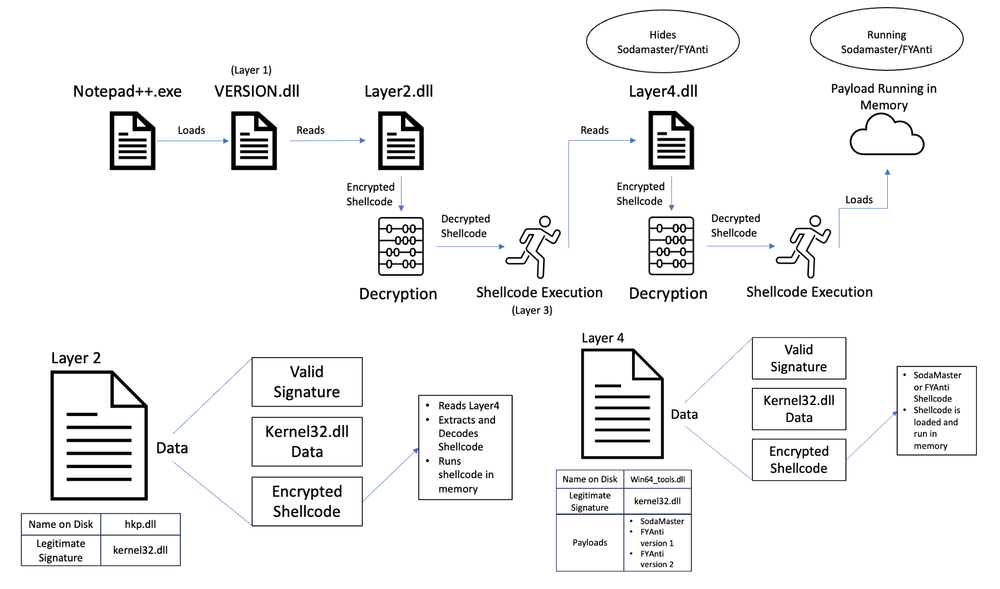

# SigLoader Capability

The SigLoader cabability uses both DLL side-loading and reflective DLL loading to install fileless malware
on a system by deploying it into memory. It first uses a legitimate DLL to side-load the first loader file.
This file then extracts data from the end of another DLL that has been modified in a way that keeps it's
signature vaild. It then loads the next loader into memory. This process is repeated once more for the third
loader. The third loader, depending on the setup, will either deploy FYAnti or SodaMaster by loading them
into memory.

Each time we load something into memory, we will be using sRDI.

## Building payloads

A powershell script has been included to convert a dll into shellcode using sRDI. By default the script will output a text file with the shelcode as a string.
It also provides the ability to create a formated cpp array of the shellcode for testing purposes.

When compiling payloads to be run via dll side-loading, ensure that you are using the 'Release' flag in cmake. It will not work if compiled as 'Debug'.

Run from `SigLoader` folder:

1. Building SigLoader for SodaMaster and FYAnti
	* The `build_sigloader.ps1` file will generate each section needed to run Sodamaster, this includes compiling the loaders and appending them to a DLL
	* Check the variables at the top of the `build_sigloader.ps1` script and update them accordingly using your filenames and paths.
	* If the Sodamaster DLL or FYAnti shellcode are missing from the `payload` directory, that build will be skipped
	* Output files will be placed in their respective subdirectories 
	* Running the script
		* `.\build_sigloader.ps1`
1. Generating just the shellcode
	* Generating shellcode string
		* `.\util\build_shellcode.ps1 -dllPath C:\Path\To\DLL.dll -funcName ExportedFunctionName -outFileName payload`
	* Generating a cpp array for testing
		* `.\util\build_shellcode.ps1 -dllPath C:\Path\To\DLL.dll -funcName ExportedFunctionName -outFileName payload -cpp $True`

### Layer 1 loader 

The layer 1 loader is the only one that uses dll side-loading to execute its payload. After deciding on the executable/dll to use, we need to set up proxy
commands to forward the appropriate calls to the correct dll. A variety of tools can be used to extract the exported functions, additionally for 
dlls' stored in 'System32' there is a github repository that includes all of the proxy commands ([here](https://github.com/magnusstubman/dll-exports/tree/main)).
Copy these lines to the top of the layer 1 loader, and then the loader code is called when the dll is loaded in memory.

Currently we are using Notepad++.exe and VERSION.dll for loading our implant.

After appending the payload to the Layer 2 loader, update the CMake file with the payload size. Leave the keys and ancryption order used for SigFlip the same.

### SigFlip

A tool used to append data to the end of a signed binary while keeping the digital signature valid.

The tool has been modified to allow for the use of AES-CBC, DES, and XOR encryption of the payload before being 
added to the file. The order of this encryption can be specified by editing the list in the code and then 
re-compiling it.

A generated diff file for both the [SigFlip.cpp](./util/sigflip_diff.txt) and [Helper.cpp](./util/helper_diff.txt) 
can be found in the `util` directory.

### Cleaning strings from layer1

Currently there are some debug lines that are added to the layer1 executable from cryptopp. These lines include the filepath to the 
user who compiled the program, so they need to be removed.

1. Open `layer1.dll` in [HexD](https://mh-nexus.de/en/hxd/)
1. Use the `Find` tool to search for your username
1. When found, highlight the entire filepath that you want removed (in either the hex or ascii portion, both work)
1. Select `Edit -> Fill Selection`
1. Select the `Zerobytes` option from the pop-up and close the window
1. Search the rest of the file for your username and repeat the above steps

### Use
1. Compile the binary using CMake
	1. In the CMake file update the variables to set the encryption order and keys
1. Create a text file with the data you want to embed
	1. For test purposes, named `test.txt`
1. Run the binary with the `-i` flag
	1. `sigflip.exe -i C:\\Path\\To\Signed\\Binary.dll .\\test.txt .\\modified_binary.dll`
	1. `sigflip.exe -i C:\\Windows\\System32\\kernel32.dll .\\test.txt .\\modified_kernel32.dll`
1. Right click the new dll and confirm the signature is valid
1. Take note of the payload size that is outputted from sigflip. This value needs to be added to the CMake file to compile the loader.

## Deploying

SigLoader and payload components will be staged in the payloads folder for use with the evalsC2server's Simple File Server.

These components will eventually be downloaded to victim machines using the `certutil` utility.

## Using Scheduled Task

A schedlued task is created to automatically run the executable that loads SigLoader. The task can be generated for either a domain admin or System.

Open an administrative shell to run the following commands:
1. Domain Admin
	1. `schtasks /create /sc minute /mo <how often to run> /tn <Name of Task> /tr <Path to Executable> /rl <Privilege Level>`
	1. `schtasks /create /sc minute /mo 15 /tn "Notepad++ Script" /tr "C:\Program Files\Notepad++\notepad++.exe" /rl HIGHEST`
1. System
	1. `schtasks /create /sc minute /mo <how often to run> /tn <Name of Task> /tr <Path to Executable> /rl <Privilege Level> /ru System`
	1. `schtasks /create /sc minute /mo 15 /tn "Notepad++ Script" /tr "C:\Program Files\Notepad++\notepad++.exe" /rl HIGHEST /ru System`
1. Run From DC to Remote Server
	1. `schtasks /create /sc minute /mo <how often to run> /tn <Name of Task> /tr <Path to Executable> /rl <Privilege Level> /s <Remote Server Name> /ru <User>`

Deleting the Scheduled Task
1. Locally:
	1. `schtasks /delete /tn <Name of Task> /f`
	1. `schtasks /delete /tn "Notepad++ Script" /f`
1. Remotely
	1. `schtasks /delete /tn <Name of Task> /s <Remote Server Name> /f`

## Cleanup

A cleanup script had been provided in the [cleanup](../cleanup/SigLoader) folder. The script will close Notepad++ and delete any files that 
are needed to run SigLoader. Additionally it will check for and deelete SigLoaders debug file. Finally it checks for and deletes any service 
or scheduled task created to run SigLoader.

Runing the file:
1. Open Powershell in Administrative mode
1. Run the cleanup script
    * `./cleanup.ps1`
## References
1. https://securelist.com/apt10-sophisticated-multi-layered-loader-ecipekac-discovered-in-a41apt-campaign/101519/#:~:text=The%20Ecipekac%20Layer%20I,it%E2%80%99s%20divisible%20by%20eight
1. https://github.com/med0x2e/SigFlip
1. https://github.com/monoxgas/sRDI
1. https://github.com/magnusstubman/dll-exports/tree/main
