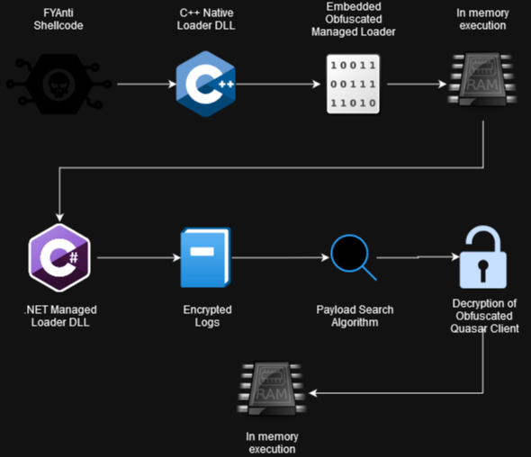
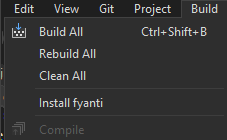
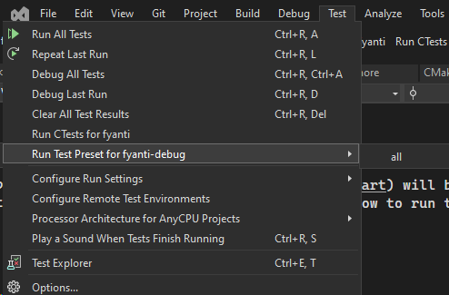
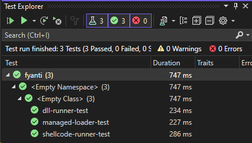

# FYAnt



FYAnti is the last loader for MenuPass. It is responsible for executing the
final interactive payload, in the case of our scenario,
[QuasarRat](../Quasar/). FYAnti itself is loaded by [Sigloader](../SigLoader).
FYAnti consists of two primary components:

1. Managed loader
2. Native loader

Additionally, this project will bundle an encrypted and obfuscated version of
the [QuasarRat client](../Quasar/bin/) along with its installation artifacts.

## Managed Loader

The [managed loader](src/managed-loader) is a C# .NET loader with the following
features:

- Payload search algorithm
- Decryption routine
- .NET loader
- Logging

The managed loader will search `C:\Windows\Microsoft.NET` for an encrypted
payload meeting the configured file size criteria. If it succesfully decrypts
a file, it will then use the `Load` capability of `System.Reflection` to
execute the decrypted memory buffer as a .NET assembly. In production, this
payload is an obfuscated and encrypted version of the
[Quasar client](../Quasar/bin/), however during testing the client can be
replaced with the included encrypted test assembly. The test assembly simply
logs a message to stdout.

`Managed loader -> Search algorithm -> Encrypted file on disk -> Obfuscated Quasar client`

## Native Loader

The [native loader](src/native-loader) is a C++ .NET loader with the following
features:

- Embedded managed loader
- Native CLR host (.NET from C++)
- sRDI compatible

The native loader contains an embedded obfuscated version of the managed
loader. In order to interop with .NET from C++, it uses Microsoft provided API
functions to load the .NET Common Language Runtime (CLR) into the current
process. It can then invoke the entrypoint of its embedded .NET managed loader
from memory. The native loader is ultimately packaged as an sRDI payload so
that it too can be executed from memory.

`sRDI -> Native loader -> Embedded obfuscated managed loader`

## Build 🏗️

FYAnti can be built in Debug or Release mode using the included
`CMakePreset.json` configurations.

### Dependencies

- `CMake` version `3.26`
- `CMakePresets.json` version `6` support (Visual Studio 17.7)

### Quickstart

#### Command Line

Build both Debug and Release configurations of FYAnti.

```PowerShell
cd menu_pass/Resources/fyanti
cmake.exe --workflow --preset cicd-debug
cmake.exe --workflow --preset cicd-release
```

For simplicity, all of the generated artifacts can be bundled into the
top-level `install/` directory using the CMake installation facility.

```PowerShell
cmake.exe --install ./build --config release
cmake.exe --install ./build --config debug
```

`./install/Release/native-loader.dll.srdi` is the production payload for
FYAnti. `shellcode-runner.exe` will inject a copy of `native-loader.dll.srdi`
into itself for independent testing.

> **Important**
> Bear in mind, release mode FYAnti expects the encrypted `client.exe.enc` to
> reside within the `C:\Windows\Microsoft.NET` directory.

The remaining artifacts are simply for debugging and archival purposes. For
more information see the [Install section](#artifacts)

### Build Presets

#### Command Line

```PowerShell
cmake.exe --build --preset fyanti-release # Or fyanti-debug
```

#### Visual Studio

After selecting the fyanti-release configuration preset:
`Build -> Build All`



## Install 📦

Installing FYAnti simply copies all of the artifacts from both Release
and Debug builds into the top-level `install/` directory. This is simply for
ease of use and distributability.

The final product should be a top-level directory named `install/` with the
following layout:

```PowerShell

fyanti/
├─ install/
   ├─ Debug/
   │  ├─ Confused/
   │  │  ├─ managed-loader.dll
   │  │  ├─ managed-loader.pdb
   │  │  ├─ test-assembly.dll
   │  │  ├─ test-assembly.pdb
   │  ├─ aes-tool.exe
   │  ├─ aes-tool.pdb
   │  ├─ client.exe.enc
   │  ├─ client.exe.pdb
   │  ├─ ConfuserSettings.crproj
   │  ├─ dll-runner.exe
   │  ├─ dll-runner.pdb
   │  ├─ embedded.hpp
   │  ├─ managed-loader.dll
   │  ├─ managed-loader.pdb
   │  ├─ native-loader.dll
   │  ├─ native-loader.pdb
   │  ├─ native-loader.dll.srdi
   │  ├─ native-loader.lib
   │  ├─ net-runner.exe
   │  ├─ net-runner.pdb
   │  ├─ shellcode-runner.exe
   │  ├─ shellcode-runner.pdb
   │  ├─ test-assembly.dll
   │  ├─ test-assembly.dll.enc
   │  ├─ test-assembly.dll.pdb
   ├─ Release/
      ├─ Confused/
      │  ├─ managed-loader.dll
      │  ├─ test-assembly.dll
      ├─ aes-tool.exe
      ├─ client.exe.enc
      ├─ ConfuserSettings.crproj
      ├─ dll-runner.exe
      ├─ embedded.hpp
      ├─ managed-loader.dll
      ├─ native-loader.dll
      ├─ native-loader.dll.srdi
      ├─ native-loader.lib
      ├─ net-runner.exe
      ├─ shellcode-runner.exe
      ├─ test-assembly.dll
      ├─ test-assembly.dll.enc
```

### Artifacts

- `client.exe.enc` is the encrypted and obfuscated Quasar client
- `managed-loader.dll` is the managed-loader 😁
- `net-runner.exe` is a test runner which executes the managed-loader independently
- `embedded.hpp` contains the obfuscated managed-loader as a native byte array
- `native-loader.dll` is the native-loader 😁
- `dll-runner.exe` is a test runner which executes the native-loader independently
- `native-loader.dll.srdi` is an sRDI wrapped version of the native-loader 😁
- `shellcode-runner.exe` is a test runner which executes the sRDI native-loader payload
- `test-assembly.dll.enc` is a stub payload that replaces the obfuscated and encrypted Quasar client when testing
- `aes-tool.exe` is a .NET utility to encrypt payloads during build and decrypt logs
- `Confused/` contains [ConfuserEx](https://mkaring.github.io/ConfuserEx/) obfuscated version of artifacts

> **Important**
> There are some differences in the functionality of FYAnti between Release
> and Debug configurations. Please read the
> [Troubleshoot section](#troubleshoot) for more information.

#### Command Line

```PowerShell
cmake.exe --install ./build
```

#### Visual Studio

`Build -> Install FYAnti`


## Test 🧪

The `cicd-debug` [CMake workflow](#command-line) will build and test FYAnti with a
single command. This section details how to run tests independently from a build
process.

### Tools

FYAnti includes runners to test each layer of the final payload independently:

- `net-runner.exe` executes the managed loader by itself to rule out interop issues
- `dll-runner.exe` executes the native loader before it's wrapped with sRDI
- `shellcode-runner.exe` executes the production shellcode version of FYAnti

A test .NET assembly is also included. This assembly has an entrypoint
identical to the Quasar client assembly. Addtionally the test assembly is
obfuscated and encrypted identically to the Quasar client. If the entrypoint
is executed successfully, from a program with accessible stdout, the following
message will be logged to the console:
> Invoked Quasar.Client.Program.Main from test-assembly

The included tests will verify that each layer of the FYAnti chain can
successfully invoke the entrypoint of the test assembly. If all three runners
invoke the test assembly without error the build is considered stable.

> **Warning**
> SigLoader may be sideloaded into a program that does not have a console
> attached. If that's the case the test assembly message will not be visible.
> As an alternative rely on the [managed loader logs](#logs) for end-to-end
> tests.

#### Command Line

```PowerShell
ctest.exe --preset all
```

#### Visual Studio

`Test -> Run test preset for FYAnti -> all`



`Test Explorer` can also be used however test discovery can be unreliable
without a fresh build.



## Troubleshoot 🤔

### Logs

The managed loader creates an encrypted log file in `C:\Windows\Microsoft.NET`
named `QLoaderLogs.txt`. To view the logs use the included `aes-tool.exe` to
decrypt them to stdout.

```PowerShell
./aes-tool.exe  -d QLoaderLogs.txt
```

> **Note**
> Debug builds will log to `QLoaderLogs.txt` in the current working directory.
> Logs are not encrypted in Debug configurations so they can be read more
> conveniently.

### Test Tools

The included [test runners and test assembly](#tools) can be used to narrow
down issues.

> **Note**
> Debug builds make use of the debug configuration of the managed loader. This
> debug configuration will search for an encrypted payload in its current
> working directory first so you don't need to stage a payload in
> `C:\Windows\Microsoft.NET`.

### Debugger

Since FYAnti interops with .NET from C++, it may be useful to configure
`WinDBG` to break on .NET CLR exceptions using the following command:

```console
sxe clr
```

If a CLR exception is caught you can then view its details:

```console
!pe
```

> **Note**
> Some CLR exceptions related to failed decryption are expected as the managed
> loader attempts to search for the encrypted payload.

> **Important**
> As always, it simpler to debug payloads which are not executed as shellcode
> because you can wire PDB information into the debugger. So if you end up with
> a crash check if you can recreate it with the debug configuration of
> `dll-runner.exe` first.

## CTI 📄

| Reports
| ----------------------------
| [APT10: Tracking down the stealth activity of the A41APT campaign](https://media.kasperskydaily.com/wp-content/uploads/sites/86/2021/02/25140359/greatidea_A41_v1.0.pdf)
| [APT10: sophisticated multi-layered loader Ecipekac discovered in A41APT campaign](https://securelist.com/apt10-sophisticated-multi-layered-loader-ecipekac-discovered-in-a41apt-campaign/101519/)
| [Threat Spotlight: menu_pass/QuasarRAT Backdoor](https://blogs.blackberry.com/en/2019/06/threat-spotlight-menupass-quasarrat-backdoor)

## References 📝

| Description                  | URL                                                             |
| ---------------------------- | --------------------------------------------------------------- |
| Load CLR from native process | [Arno0x/TestAssembly.cs](https://gist.github.com/Arno0x/386ebfebd78ee4f0cbbbb2a7c4405f74) |
| ConfuserEx2 .NET obfuscation | [https://github.com/mkaring/ConfuserEx](https://github.com/mkaring/ConfuserEx) |
