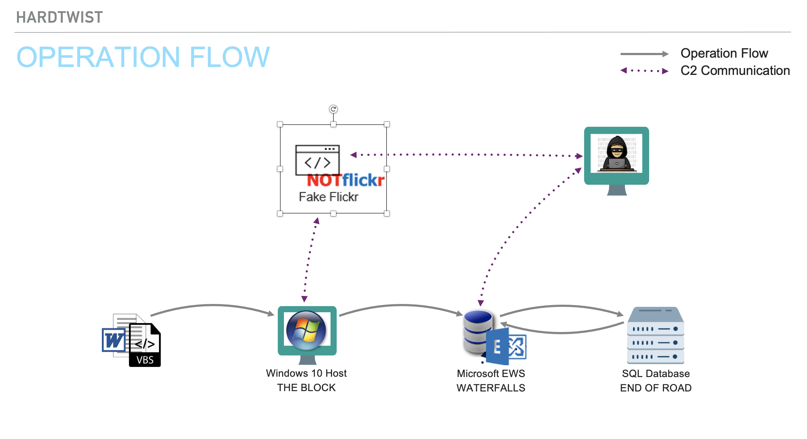
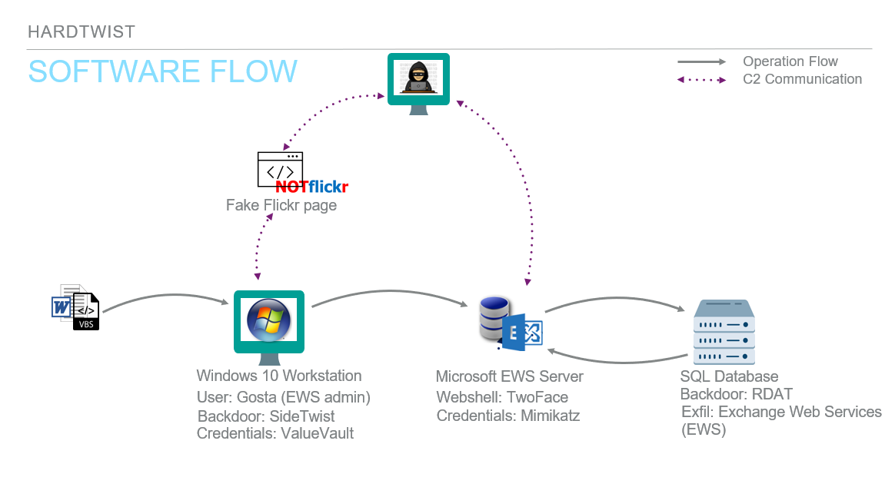
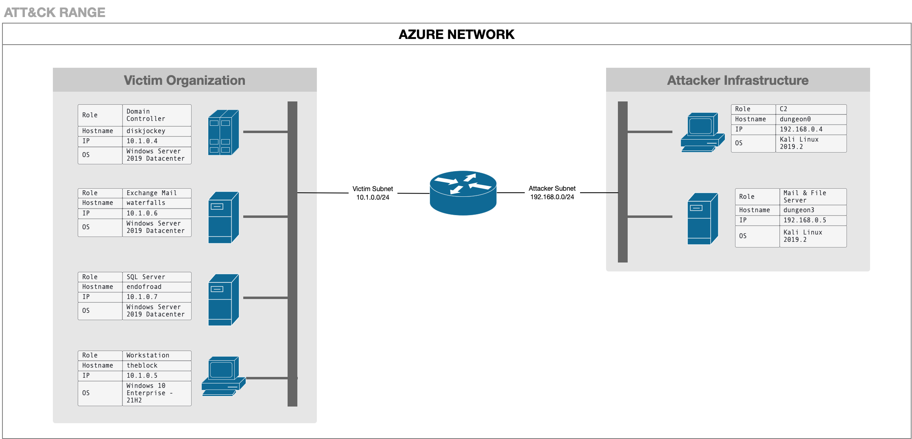

Based on open-source intelligence, the ATT&CK ® Evaluations team created the below scenario leveraging techniques seen from Oilrig in the wild. We have adapted the scenario based on tools and resources available at the time. Below is a diagram, [scenario overview](#emulation-scenario), [step-by-step breakdown](#scenario-steps), and an [infrastructure diagram](#infrastructure-diagram).

# Emulation Scenario 📖

This scenario follows OilRig’s multi-phase approach to exfiltrating sensitive data from a targeted server. OilRig leverages spearphishing to gain initial access onto an administrator’s workstation and deploys their SideTwist malware. Once persistence is established on the victim network, the attackers will escalate privileges and move laterally onto an EWS server. Further enumeration of the EWS server will lead to OilRig’s identification of a SQL server storing confidential critical infrastructure data. Characteristics of this campaign include: custom webshells, Windows and Microsoft 365 exploitation, and key attacker objective on obtaining control of the SQL server to steal victim files. 
 **Phase 1:** This scenario begins with the legitimate user Gosta downloading and opening a malicious Word document sent via spearphishing. When the document is first opened, the enabled macros will stealthily install the SideTwist backdoor on Gosta’s Windows host machine. SideTwist connects to a C2 server using GET & POST requests, with responses hidden in the source code of an NotFlickr page. After performing initial enumeration on Gosta’s device, OilRig discovers that the user is a member of the administrator group on an Exchange Web Server (EWS). 
 **Phase 2:** The SideTwist backdoor harvests credentials and collects Gosta's password using VALUEVAULT, a credential theft tool. Using Gosta’s stolen EWS credentials, the attackers establish a remote connection to EWS via RDP tunneling. Once connected to the EWS, OilRig deploys the TwoFace webshell on the server to gain access to additional resources on the network. The use of TwoFace to perform enumeration on the EWS will lead attackers to discover a SQL server. 
 **Phase 3:** Next, OilRig will use the TwoFace webshell to download Mimikatz and dump the credentials of targeted administrators on the EWS. Using the stolen credentials of Tous, an SQL admin, the adversary will perform pass-the-hash to move laterally onto the targeted SQL server. This signals the start of the data exfiltration phase. The attackers will gain persistent access to the database through the custom RDAT backdoor, copy the database backup files and exfiltrate them via the EWS API to an attacker-controlled mailbox.
  

# Scenario Steps👣

| Steps  | User Story | Software | Reporting |
| ------------- | ------------- | ------------- | ------------- |
| Step 1   (Initial Compromise & Persistence)  [T1566.002](https://attack.mitre.org/versions/v11/techniques/T1566/002)   [T1204.002](https://attack.mitre.org/versions/v11/techniques/T1204/002)   [T1059.005](https://attack.mitre.org/versions/v11/techniques/T1059/005/) [T1082](https://attack.mitre.org/versions/v11/techniques/T1082/) [T1033](https://attack.mitre.org/versions/v11/techniques/T1033/) [T1497.001](https://attack.mitre.org/versions/v11/techniques/T1497/001/) [T1027](https://attack.mitre.org/versions/v11/techniques/T1027/) [T1105](https://attack.mitre.org/versions/v11/techniques/T1105/) [T1036](https://attack.mitre.org/versions/v11/techniques/T1036/) [T1083](https://attack.mitre.org/versions/v11/techniques/T1083/) [T1053.005](https://attack.mitre.org/versions/v11/techniques/T1053/005/) [T1016](https://attack.mitre.org/versions/v11/techniques/T1016/) [T1071.001](https://attack.mitre.org/versions/v11/techniques/T1071/001/) [T1573.001](https://attack.mitre.org/versions/v11/techniques/T1573/001/) |OilRig gains initial access from user Gosta (`THE BLOCK`, `10.1.0.5`) downloading and opening a Microsoft Word document received from a spearphishing email. Once Gosta enables the malicious macros embedded in the document, the SideTwist payload is stealthily dropped onto the system. The executable is initially named `b.doc` and will later be renamed to `SystemFailureReporter.exe`.   OilRig then will use SideTwist to conduct initial discovery on the Windows host machine (`THE BLOCK`) and connect to the C2 server over XOR encrypted protocol HTTP on port 443. The attackers C2 infrastructure consists of an HTTP server that hosts a dummy `NotFlickr` page. Commands with SideTwist are embedded between `<script>` tags on this webpage.    **Analyst Note:** The document is pre-positioned in the environment. We do not emulate sending the document to target, as our focus is evaluating their product against post-initial-access TTPs. | SideTwist | <https://research.checkpoint.com/2021/irans-apt34-returns-with-an-updated-arsenal/>     <https://www.intezer.com/blog/malware-analysis/new-iranian-campaign-tailored-to-us-companies-uses-updated-toolset/> |
Step 2  (Workstation Discovery)   [T1059.003](https://attack.mitre.org/versions/v11/techniques/T1059/003/)  [T1033](https://attack.mitre.org/versions/v11/techniques/T1033/) [T1082](https://attack.mitre.org/versions/v11/techniques/T1082/)  [T1016](https://attack.mitre.org/versions/v11/techniques/T1016/)  [T1087.002](https://attack.mitre.org/versions/v11/techniques/T1087/002/)  [T1069.002](https://attack.mitre.org/versions/v11/techniques/T1069/002/)  [T1201](https://attack.mitre.org/versions/v11/techniques/T1201/)  [T1087.001](https://attack.mitre.org/versions/v11/techniques/T1087/001/)  [T1069.001](https://attack.mitre.org/versions/v11/techniques/T1069/001/) [T1049](https://attack.mitre.org/versions/v11/techniques/T1049/)  [T1057](https://attack.mitre.org/versions/v11/techniques/T1057/)  [T1007](https://attack.mitre.org/versions/v11/techniques/T1007/) [T1012](https://attack.mitre.org/versions/v11/techniques/T1012/)  [T1018](https://attack.mitre.org/versions/v11/techniques/T1018/)  |OilRig utilizes SideTwist to perform a string of initial enumeration commands via the command line. Specifically, the adversary enumerates the current user, system information and configuration, domain users, domain groups, domain accounts, local groups, network connections, running processes, running services, and a registry key value to check if RDP is enabled.  At this point, OilRig has discovered the following: the current user Gosta is a member of the EWS Admins group, the presence of an EWS server (`WATERFALLS`,`10.1.0.6`) on the network which is a part of the Exchange Trusted Subsystem group, and the existence of several other administrator groups (including SQL Admins, of which user Tous is a member).| SideTwist | SideTwist   <https://research.checkpoint.com/2021/irans-apt34-returns-with-an-updated-arsenal/>   VBA coding/macros   <https://www.intezer.com/blog/malware-analysis/new-iranian-campaign-tailored-to-us-companies-uses-updated-toolset/>   Enumeration   <https://unit42.paloaltonetworks.com/the-oilrig-campaign-attacks-on-saudi-arabian-organizations-deliver-helminth-backdoor/>   EWS/Exchange Trusted Subsystem Discovery   <https://unit42.paloaltonetworks.com/unit42-twoface-webshell-persistent-access-point-lateral-movement/>|
Step 3 (Host Discovery & Credential Collection)   [T1105](https://attack.mitre.org/versions/v11/techniques/T1105/)  [T1555.004](https://attack.mitre.org/versions/v11/techniques/T1555/004/)  [T1041](https://attack.mitre.org/versions/v11/techniques/T1041/)| In order to escalate privileges, OilRig will use SideTwist to download VALUEVAULT onto the Gosta’s device. VALUEVAULT will be used to conduct low privilege credential dumping and retrieve the plaintext password for Gosta. The attackers send this data back to the C2, obfuscating communications via HTTP POST requests.| SideTwist VALUEVAULT    Golang version of “[Windows Vault Password Dumper](https://github.com/Shiva108/CTF-notes/blob/dc11ec9dbb44520425b4f16b281940ef03dfca5d/Notes%20VA/privesc_postexploit.md)”    [Source code](http://web.archive.org/web/20190316025511/http://oxid.it/downloads/vaultdump.txt)    [Binary](http://web.archive.org/web/20190425165422/http://www.oxid.it/downloads/vaultdump.zip) | SideTwist   <https://research.checkpoint.com/2021/irans-apt34-returns-with-an-updated-arsenal/>  VALUEVAULT  <https://www.mandiant.com/resources/hard-pass-declining-apt34-invite-to-join-their-professional-network>   Hard Pass  <http://web.archive.org/web/20190316025511/http://oxid.it/downloads/vaultdump.txt> |
Step 4 (Web Shell Installation)   [T1105](https://attack.mitre.org/versions/v11/techniques/T1105/)   [T1570](https://attack.mitre.org/versions/v11/techniques/T1570/)   [T1505.003](https://attack.mitre.org/versions/v11/techniques/T1505/003/)  [T1564.001](https://attack.mitre.org/versions/v11/techniques/T1564/001/)  [T1070.004](https://attack.mitre.org/versions/v11/techniques/T1070/004/)| Using Gosta’s stolen EWS credentials, OilRig installs the TwoFace web shell for persistence on the EWS. This is accomplished by downloading TwoFace (named `contact.aspx`) via the SideTwist executable. The attackers will then copy the webshell from Gosta’s Windows workstation to the EWS, obfuscating the activity with `attrib + h.` OilRig covers their tracks by deleting TwoFace from Gosta’s user directory. | VALUEVAULT  TwoFace Webshell | Plink/SSH commands  <https://www.opmd.fr/blog/dnspionage-focus-on-internal-actions/>  EWS lateral movement  <https://unit42.paloaltonetworks.com/unit42-twoface-webshell-persistent-access-point-lateral-movement/>|
Step 5 (EWS Discovery)   [T1505.003](https://attack.mitre.org/versions/v11/techniques/T1505/003/)   [T1033](https://attack.mitre.org/versions/v11/techniques/T1033/)   [T1016](https://attack.mitre.org/versions/v11/techniques/T1016/)   [T1049](https://attack.mitre.org/versions/v11/techniques/T1049/)| OilRig uses the TwoFace webshell to perform enumeration on the EWS to discover the SQL server (`ENDOFROAD`,`10.1.0.7`). OilRig first uses the webshell to perform some initial discovery by enumerating the current user, system network configuration and system network connections. At this point, the attackers identify an open connection to the SQL server via a port commonly associated with SQL.    **Analyst Note:** TwoFace comprises 2 separate webshells - the first is deployed initially to save and load the second webshell, which is the one used to run commands on the compromised server. However, due to team constraints, we deployed a single webshell that can upload/download files and run commands.| TwoFace Webshell | TwoFace <https://unit42.paloaltonetworks.com/unit42-twoface-webshell-persistent-access-point-lateral-movement/>   PSExec   <https://unit42.paloaltonetworks.com/unit42-striking-oil-closer-look-adversary-infrastructure/>|
Step 6 (Credential Dumping)   [T1105](https://attack.mitre.org/versions/v11/techniques/T1105/)  [T1003.001](https://attack.mitre.org/versions/v11/techniques/T1003/001/)   [T1041](https://attack.mitre.org/versions/v11/techniques/T1041/)  [T1070.004](https://attack.mitre.org/versions/v11/techniques/T1070/004/) | OilRig uses the webshell to download Mimikatz to the EWS and uses elevated privileges to dump credentials. The dumped credentials, which include those for SQL server administrator Tous, are exfiltrated back to the C2 (`192.168.0.4`) via the webshell. After exfiltration is complete, OilRig deletes both Mimikatz and the dumped credentials from the directory on the EWS. | Mimikatz   TwoFace Webshell| Network Discovery   <https://unit42.paloaltonetworks.com/the-oilrig-campaign-attacks-on-saudi-arabian-organizations-deliver-helminth-backdoor/>   TwoFace   <https://unit42.paloaltonetworks.com/unit42-twoface-webshell-persistent-access-point-lateral-movement/>|
Step 7 (Lateral Movement to EWS)   [T1105](https://attack.mitre.org/versions/v11/techniques/T1105/)   [T1572](https://attack.mitre.org/versions/v11/techniques/T1572/)   [T1078.002](https://attack.mitre.org/versions/v11/techniques/T1078/002/)  [T1021.001](https://attack.mitre.org/versions/v11/techniques/T1021/001/)   | OilRig moves laterally onto the EWS via remote port forward using the plink command line tool. The adversary conducts a remote port forward from Gosta’s workstation to the attacking machine to allow RDP access through port 3389 as user Gosta. | TwoFace webshell   plink   SideTwist | Credential dumping   <https://unit42.paloaltonetworks.com/unit42-twoface-webshell-persistent-access-point-lateral-movement/>|
Step 8 (Lateral Movement to SQL Server)   [T1505.003](https://attack.mitre.org/versions/v11/techniques/T1505/003/) [T1105](https://attack.mitre.org/versions/v11/techniques/T1105/) [T1550.002](https://attack.mitre.org/versions/v11/techniques/T1550/002/) [T1059.003](https://attack.mitre.org/versions/v11/techniques/T1059/003/) [T1570](https://attack.mitre.org/versions/v11/techniques/T1570/) [T1021.002](https://attack.mitre.org/versions/v11/techniques/T1021/002/) [T1569.002](https://attack.mitre.org/versions/v11/techniques/T1569/002/)  |Using the credentials collected for the SQL administrator Tous, the attackers move laterally to the SQL server. First, the webshell is used to download PsExec, RDAT, and a newly named Mimikatz to disk.  Through the tunneled RDP, OilRig will open an elevated command prompt and uses Tous' NTLM hash to execute a pass-the-hash to spawn a second shell on the EWS.  As the user Tous, OilRig copies the RDAT backdoor to the SQL server and executes PsExec to get a shell on the targeted server. | PSExec   TwoFace Webshell   RDAT   Mimikatz   Cmd   | PSExec   <https://unit42.paloaltonetworks.com/unit42-striking-oil-closer-look-adversary-infrastructure/>   Pass the Hash   <https://www.clearskysec.com/wp-content/uploads/2020/02/ClearSky-Fox-Kitten-Campaign-v1.pdf>|
Step 9 (SQL Server Discovery, Collection & Exfiltration)   [T1083](https://attack.mitre.org/versions/v11/techniques/T1083/)   [T1074.001](https://attack.mitre.org/versions/v11/techniques/T1074/001/)   [T1036.006](https://attack.mitre.org/versions/v11/techniques/T1036/006/)   [T1005](https://attack.mitre.org/versions/v11/techniques/T1005/)  [T1030](https://attack.mitre.org/versions/v11/techniques/T1030/)   [T1048.003](https://attack.mitre.org/versions/v11/techniques/T1048/003/)  [T1027](https://attack.mitre.org/versions/v11/techniques/T1027/) | As the user Tous, OilRig uses the command prompt created by the Mimikatz pass the hash to perform discovery of the database backup files on the SQL server. OilRig will collect and exfiltrate the backups of the database files via the EWS API. OilRig first creates a new directory in which to stage the collected data. The attackers will move RDAT to this new directory and rename it as `VMware.exe.` The newly named backdoor is used to read the data, split it into 20,000 byte chunks, and exfiltrate it via EWS API to an attacker-controlled email (`sistan@shirinfarhad.com`). The stolen data is obfuscated within BMP images attached to the emails sent to the attackers. | cmd Mimikatz RDAT | Discovery   <https://unit42.paloaltonetworks.com/unit42-twoface-webshell-persistent-access-point-lateral-movement/>   RDAT/Exfiltration   <https://unit42.paloaltonetworks.com/oilrig-novel-c2-channel-steganography/>  TwoFace  <https://unit42.paloaltonetworks.com/unit42-twoface-webshell-persistent-access-point-lateral-movement/> C2 Communications  <https://unit42.paloaltonetworks.com/the-oilrig-campaign-attacks-on-saudi-arabian-organizations-deliver-helminth-backdoor/>|
Step 10 (Clean-up & Egress)   [T1070.004](https://attack.mitre.org/versions/v11/techniques/T1070/004/) | Finally, the adversary deletes all artifacts and files from the EWS and SQL server, terminates command prompts, ups and exits the target network. | cmd

# Infrastructure Diagram

